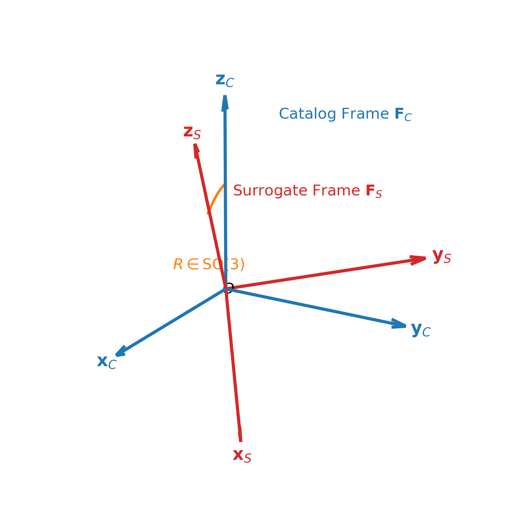
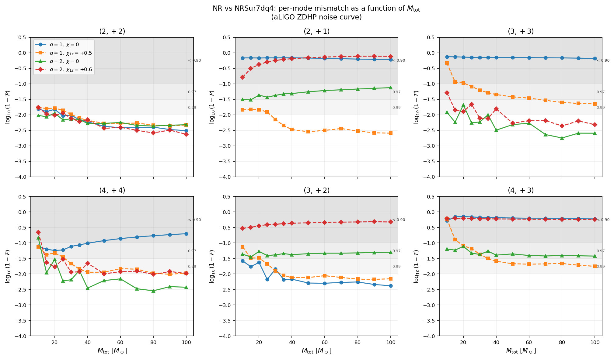
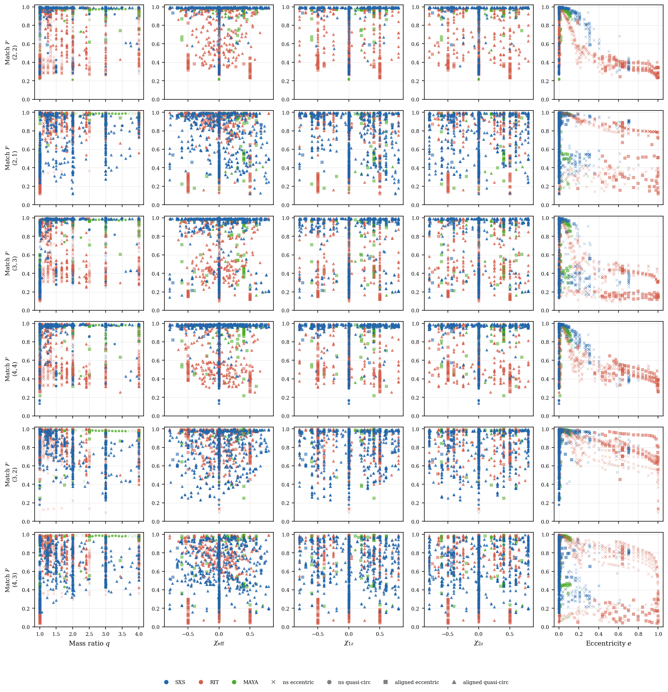
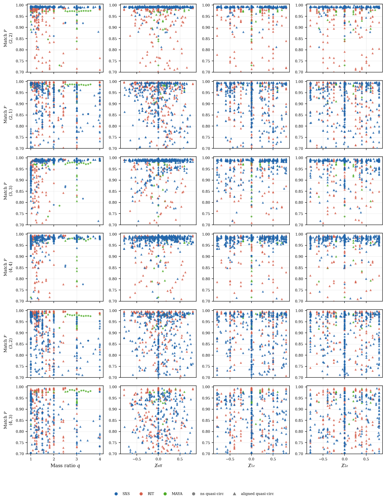
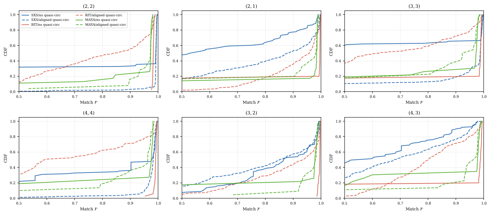
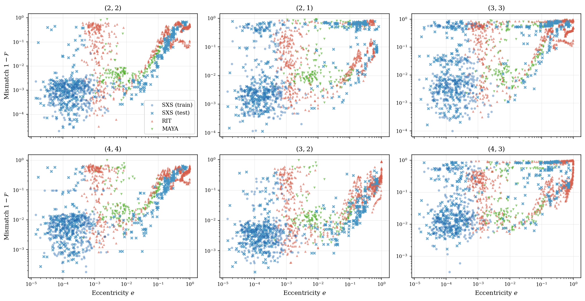
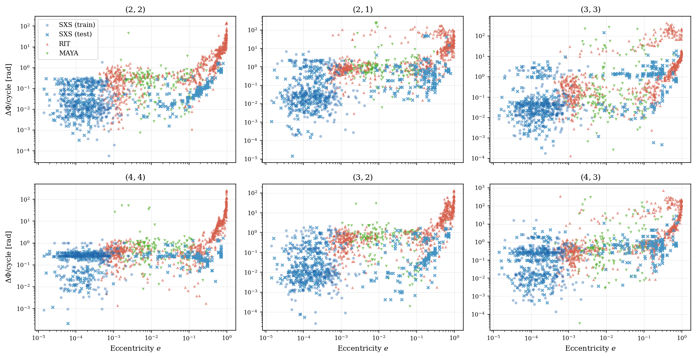
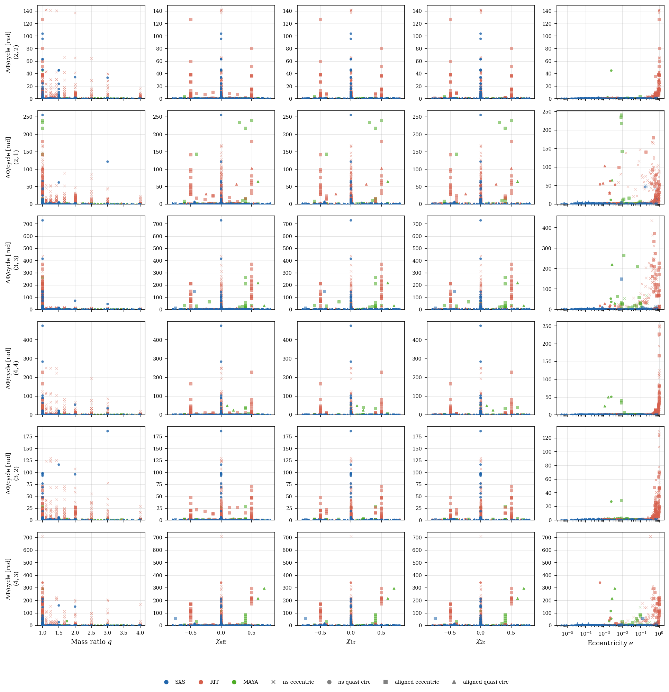
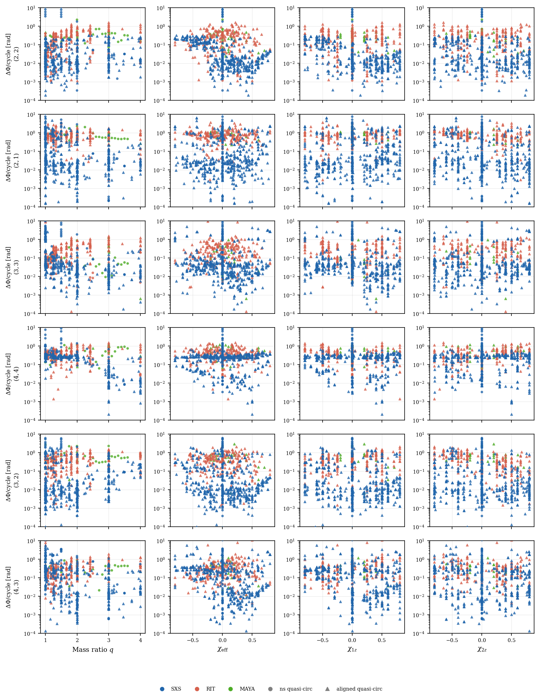
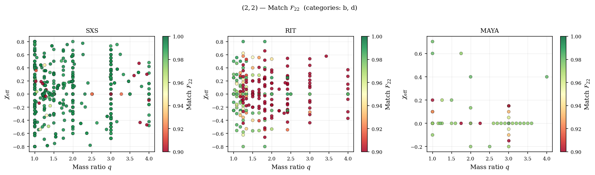

# Surrogate-Mediated Cross-Catalog Validation of Numerical Relativity Binary Black Hole Waveforms

**Prayush Kumar** _et al._

_Draft — not for circulation_

---

## Abstract

We present a systematic framework for comparing binary black hole gravitational waveforms produced by independent numerical relativity (NR) codes. By employing the NRSur7dq4 surrogate model as a common reference, our method eliminates the parameter-space mismatches that have historically obstructed direct cross-catalog comparisons. Agreement is quantified via two complementary metrics: the noise-weighted match evaluated for individual spherical harmonic modes using the Advanced LIGO design sensitivity, and the accumulated phase difference per gravitational-wave cycle. Applying this framework, we conduct a batch comparison of 1,648 non-spinning and aligned-spin simulations from the SXS, RIT, and MAYA catalogs. For the dominant $(2,2)$ mode in quasi-circular configurations, all catalogs demonstrate excellent baseline agreement, routinely achieving mismatches below $10^{-2}$. By tracking the mode-by-mode degradation as a function of initial eccentricity, we empirically confirm the surrogate's quasi-circular assumptions, demonstrating that sub-dominant harmonics (e.g., $(3,3)$ and $(4,4)$) degrade much more aggressively under eccentric modulation than the $(2,2)$ mode. Furthermore, we distinguish in-sample SXS simulations used for surrogate training from out-of-sample ones, isolating the model's interpolation boundaries. We discuss the implications of these findings for waveform modeling and parameter estimation, and outline future extensions including rigorous treatments of source-frame ambiguities and BMS supertranslations.

---

## I. Introduction

The successful simulation of binary black hole (BBH) mergers in 2005 marked a watershed moment in computational astrophysics, resolving decades of theoretical and numerical challenges. In the years immediately following these breakthroughs, numerical relativity (NR) evolved rapidly from a proof-of-principle endeavor—capable of producing only a handful of short, marginally stable waveforms—into a robust, high-precision discipline. Advances in gauge conditions, constraint-damping formulations, and scalable computational architectures enabled codes to routinely evolve BBH systems through inspiral, merger, and ringdown with exquisite accuracy.

As the first robust simulations became available, early community-wide efforts laid the foundational groundwork for integrating NR into the nascent data analysis ecosystem. The NINJA-1 project [Aylott *et al.*, Class. Quantum Grav. 26 165008 (2009)] pioneered the injection of these initial NR waveforms into simulated detector noise to evaluate the performance of early gravitational-wave search pipelines. NINJA-2 [Ajith *et al.*, Class. Quantum Grav. 29 124001 (2012)] extended this initiative by utilizing longer, more accurate waveforms to test the impact of NR errors on parameter estimation and early analytical model calibration. Subsequently, the Numerical Relativity and Analytical Relativity (NRAR) collaboration [Hinder *et al.*, Class. Quantum Grav. 31 025012 (2014)] focused on benchmarking the leading analytical waveform models of the era against a consolidated, multi-group set of NR simulations. While these landmark efforts successfully established the critical role of NR in data analysis, they largely predated the systematic, large-scale exploration of the parameter space.

Over the last decade, this continued maturation has culminated in the production of comprehensive, high-volume public waveform databases by multiple independent collaborations. Chief among these are the SXS catalog [Boyle *et al.*, Class. Quantum Grav. 36 195006 (2019)], produced by the Spectral Einstein Code (SpEC); the RIT catalog [Healy *et al.*, Phys. Rev. D 96 024031 (2017)], produced by the LazEv code; and the Georgia Tech / UT Austin MAYA catalog [Jani *et al.*, Class. Quantum Grav. 33 204001 (2016)], produced by the MayaKranc code. Each of these catalogs covers overlapping regions of the binary parameter space and is relied upon by the gravitational-wave data analysis and waveform modeling communities as an indispensable ground truth.

The practical importance of these modern, densely sampled NR catalogs cannot be overstated. Gravitational-wave detection and parameter estimation pipelines (such as PyCBC [Nitz *et al.*, PyCBC v2.4.0 (2023)], LALSuite [LIGO Scientific Collaboration, LALSuite (2023)], and Bilby [Ashton *et al.*, ApJS 241 27 (2019)]) extensively use NR waveforms as high-fidelity injection signals and as calibration targets. Furthermore, analytical waveform models — including effective-one-body (EOB) frameworks, phenomenological (IMRPhenom) families, and NR surrogate models — are directly calibrated and validated against these numerical datasets. A systematic bias or unquantified error in any particular catalog will therefore propagate directly into model calibrations and, through them, into the parameter estimation for every observed gravitational-wave event. Quantifying this bias is not merely an academic exercise: it sets a fundamental floor on the accuracy of waveform models and, ultimately, limits our ability to extract precise astrophysical and cosmological information from current and future gravitational-wave observations.

However, conducting the rigorous, direct inter-catalog cross-validation that this sensitivity demands is primarily obstructed by a fundamental difficulty: **parameter-space mismatch**. Different NR codes reach their initial conditions through distinct theoretical formalisms and numerical procedures. For example, the SXS catalog uses the Spectral Einstein Code (SpEC), which constructs initial data by solving the Extended Conformal Thin-Sandwich (XCTS) equations using multi-domain pseudospectral methods [Pfeiffer *et al.*, Comput. Phys. Commun. 152 253 (2003); Ossokine *et al.*, Phys. Rev. D 92 104028 (2015)], followed by an iterative procedure to tune orbital parameters and reduce initial eccentricity. In contrast, both the RIT (LazEv) and MAYA (MayaKranc) catalogs generally employ the moving-punctures framework, constructing initial data by solving the Bowen-York momentum constraints—commonly relying on tools like the TwoPunctures solver [Ansorg *et al.*, Phys. Rev. D 70 064011 (2004)]. Because these distinct mathematical formulations define the initial orbital separation, spin magnitudes, spin orientations, and center-of-mass velocity differently, matching the physical initial data precisely across codes is computationally expensive and never exact. As a result, for two catalog simulations $h^A(\boldsymbol{\theta}_i)$ and $h^B(\boldsymbol{\theta}_j)$ that nominally represent the same binary, the residual parameter-space distance $|\boldsymbol{\theta}_i - \boldsymbol{\theta}_j|$ can easily dominate over the intrinsic numerical errors one hopes to measure [Hannam *et al.*, Phys. Rev. D 79 084025 (2009)]. In the worst case, $\|h^A(\boldsymbol{\theta}_i) - h^B(\boldsymbol{\theta}_j)\|$ is comparable to $\|h^A(\boldsymbol{\theta}_i) - h^A(\boldsymbol{\theta}_k)\|$ for a nearby point $\boldsymbol{\theta}_k$ in the same catalog — i.e., the cross-catalog difference is dominated by the interpolation error of the catalog itself.

**Surrogate models as comparison mediators.** The advent of high-accuracy NR surrogate models opens a new avenue for cross-catalog validation. Surrogate models are fast, data-driven interpolants built directly from a set of high-fidelity NR training waveforms using reduced-order modeling techniques. Unlike traditional analytical waveform models (e.g., EOB or phenomenological models) which rely on physical approximations and fitting formulas to capture full waveform phenomenology, surrogates perform basis decomposition and empirical interpolation mode-by-mode. As a result, within their training domain, they can faithfully reproduce the original NR waveforms—complete with sub-dominant modes and complex precession dynamics—with errors comparable to the intrinsic numerical truncation errors of the training simulations themselves. 

A leading example is NRSur7dq4 [Varma *et al.*, Phys. Rev. Research 1 033015 (2019)], a fully precessing surrogate trained on 1528 SpEC simulations. Several of its technical characteristics dictate the structure of our comparative framework. First, the model interpolates waveform coefficients decomposed into spin-weight $-2$ spherical harmonics up to $\ell=4$ in a co-precessing frame, providing direct access to higher-order harmonics but strictly fixing the source-frame orientation convention to that of its SpEC training data. Second, NRSur7dq4 is trained exclusively on quasi-circular ($e=0$) binaries with mass ratios $q \le 4$ and spin magnitudes $\chi \le 0.8$. This strict domain limitation means that evaluating the surrogate on highly eccentric or boundary-case parameters probes its extrapolation behavior, allowing us to use eccentric configurations as a built-in negative control for our comparative metrics. 

Given any binary configuration $\boldsymbol{\theta}$ within the surrogate's domain, it can produce analytical outputs at those *exact* parameters, eliminating the parameter-space mismatch entirely. The direct inter-catalog comparison then reduces to measuring:

$$\|h^A(\boldsymbol{\theta}_i) - h^{\rm sur}(\boldsymbol{\theta}_i)\|,$$

where $h^{\rm sur}$ is the surrogate evaluated at the catalog's own parameters. Crucially, because NRSur7dq4 is built exclusively from a suite of SXS simulations, it acts as an analytical proxy for the SpEC codebase. Consequently, this surrogate-mediated framework strictly evaluates how well other catalogs agree with the SXS baseline, rather than providing an independent, code-agnostic metric of absolute numerical accuracy.

**Technical ambiguities in comparisons.** While the surrogate resolves the physical parameter-space mismatch, comparing two independently generated sets of waveform modes still requires careful treatment of unphysical gauge choices. Different NR codes define the orientation of their source frame $\mathbf{F}_s$ using distinct conventions—for example, aligning the $z$-axis with the instantaneous orbital angular momentum at the relaxation time versus the beginning of the simulation. This introduces an arbitrary, rigid SO(3) rotation between the two mode sets. Furthermore, the asymptotic symmetry group at null infinity $\mathcal{I}^+$ includes infinite-dimensional Bondi–Metzner–Sachs (BMS) supertranslations, meaning different waveform extraction methods naturally live in different BMS frames. In this article, we proactively address these technical difficulties by implementing a comprehensive post facto optimization framework. We systematically remove these unphysical gauge degrees of freedom by maximizing the noise-weighted waveform match over arbitrary time and phase shifts, SO(3) rigid frame rotations, and BMS supertranslations. Any residual discrepancy remaining after this optimization strictly reflects a combination of true numerical error in the NR simulation and interpolation error within the surrogate itself, which we subsequently isolate and quantify.

**Summary of Results.** Applying this framework to a batch of 1,648 non-spinning and aligned-spin waveforms across the SXS, RIT, and MAYA catalogs, we find that the dominant $(2,2)$ mode achieves excellent baseline agreement across all three catalogs for quasi-circular systems, confirming that modern, independently developed numerical relativity codes are highly consistent in this regime. By tracking the mode-by-mode degradation as a function of initial eccentricity, we empirically confirm the surrogate's quasi-circular assumptions, demonstrating a deterministic power-law escalation of the mismatch. We show that sub-dominant harmonics (e.g., $(3,3)$ and $(4,4)$) degrade much more aggressively under eccentric modulation than the $(2,2)$ mode. Furthermore, by explicitly partitioning the SXS catalog into the NRSur7dq4 calibration set and an independent test set, we isolate the surrogate's interpolation error from broader generalization limits, confirming near-perfect in-sample agreement while identifying parameter-space boundaries where out-of-sample accuracy drops.

The organization of this paper is as follows. Section~II describes the formalism for source-frame ambiguities and defines the match and phase-difference metrics. Section~III introduces the numerical relativity catalogs, describes the NRSur7dq4 surrogate, and outlines the computational pipeline. Section~IV presents pilot results for four SXS simulations, followed by the large-scale batch comparison of non-spinning and aligned-spin systems. Section~V outlines planned extensions, including full SO(3) frame-rotation optimization and BMS supertranslation corrections.

---

## II. Formalism

### A. Waveform Multipoles and Coordinate Ambiguities

We work with the strain decomposed at null infinity $\mathcal{I}^+$ in spin-weight $-2$ spherical harmonics in a fixed inertial source frame $\mathbf{F}_s$:

$$H(t, \iota, \phi_c) = h_+(t) - i h_\times(t) = \sum_{\ell \geq 2} \sum_{m=-\ell}^{\ell} {}^{-2}Y_{\ell m}(\iota, \phi_c)\, h_{\ell m}(t; \boldsymbol{\theta}),$$

where $\iota$ and $\phi_c$ are the polar angles of the detector in the source frame, and $\boldsymbol{\theta}$ denotes the intrinsic binary parameters (mass ratio $q$ and individual spin vectors $\boldsymbol{\chi}_{1,2}$). Each catalog simulation provides the complex time series $h_{\ell m}(t)$ in its own source frame convention.

To connect this mathematical decomposition with physical numerical relativity (NR) datasets, it is instructive to examine how these multipoles are constructed from raw spacetime metrics. In Cauchy (3+1) spacetimes evolved by codes like SpEC (SXS), LazEv (RIT), and MayaKranc (MAYA), gravitational radiation is extracted at coordinate spheres at finite radii $R_{\rm ext}$ (typically spanning $100M$ to $400M$). Collaborations use either the Regge-Wheeler-Zerilli (RWZ) perturbative formalism or the Newman-Penrose Weyl curvature scalar $\Psi_4$ to reconstruct the gravitational-wave strain at null infinity.

**The Regge-Wheeler-Zerilli (RWZ) Formalism.** This perturbative approach treats the outer regions of the simulation domain as a spherically symmetric Schwarzschild background of mass $M$. The metric perturbations $h_{\mu\nu} = g_{\mu\nu} - g^{\rm background}_{\mu\nu}$ are projected onto a basis of tensor spherical harmonics. By isolating the polar (even parity) and axial (odd parity) metric perturbations, one solves the Zerilli and Regge-Wheeler radial master equations, respectively. The resulting master variables directly yield the gauge-invariant strain multipoles $h_{\ell m}(t)$ at the extraction boundary. The primary advantage of the RWZ method is its gauge-invariant construction, which mitigates coordinate gauge ambiguities at finite radii.

*A Note on Background Geometry (Schwarzschild vs. Kerr):* A beginning graduate student might naturally wonder why the Schwarzschild metric is assumed here rather than the Kerr metric, given that the merging black holes typically possess spin. Mathematically, metric perturbations on a rotating Kerr background do not separate cleanly into simple polar and axial tensor spherical harmonics; instead, one must solve the more complex Teukolsky equation, which is formulated in terms of the Weyl scalar $\Psi_4$ (NP formalism) rather than metric perturbations $h_{\mu\nu}$. In practical NR wave extraction, however, coordinate spheres are placed in the asymptotic far-field ($R_{\rm ext} \ge 100M$). In this regime, the leading-order spacetime metric is dominated by the total mass $M$ of the system (scaling as $\sim M/R_{\rm ext}$), while the spin-induced frame-dragging corrections are sub-leading (scaling as $\sim J/R_{\rm ext}^2$). Consequently, collaborations using RWZ extraction standardly approximate the background metric at these large extraction boundaries as Schwarzschild, treating any spin-induced deviations as higher-order perturbations. For systems where strong-field precession or high spins dominate near the extraction zone, the Teukolsky ($\Psi_4$) formalism is mathematically superior as it naturally accommodates the Kerr background.

**The Newman-Penrose Weyl Scalar $\Psi_4$.** Alternatively, collaborations measure the curvature directly via the Weyl curvature scalar $\Psi_4$, defined by projecting the Weyl tensor $C_{\alpha\beta\gamma\delta}$ onto a null tetrad $\{l^\mu, n^\mu, m^\mu, \bar{m}^\mu\}$:

$$\Psi_4 = -C_{\alpha\beta\gamma\delta} n^\alpha \bar{m}^\beta n^\gamma \bar{m}^\delta.$$

At null infinity, the outgoing radiation encoded in $\Psi_4$ relates to the strain $h = h_+ - i h_\times$ via two time derivatives:

$$\Psi_4 = \ddot{h}_+ - i \ddot{h}_\times = \ddot{h}.$$

To construct the strain multipoles $h_{\ell m}(t)$, one must double-integrate $\Psi_{4,\ell m}(t)$ over time:

$$h_{\ell m}(t) = \lim_{R \to \infty} \int_{-\infty}^t dt' \int_{-\infty}^{t'} dt'' \, R \Psi_{4,\ell m}(t'').$$

In practice, this numerical double integration is exceptionally sensitive to low-frequency noise, non-zero integration constants, and initial "junk radiation" (the spurious transient wave generated by initial data that do not perfectly represent the historical inspiral). Standard integration methods can lead to severe quadratic or linear secular drifts. To combat this, collaborations use techniques like fixed-frequency integration (FFI) [Reisswig and Pollney, Class. Quantum Grav. 28, 195015 (2011)], which filters out unphysical low-frequency modes by executing the integration in the frequency domain with a sharp high-pass cutoff $f_{\rm cutoff}$. To remove coordinate distortions at finite radii, these complex multipoles are subsequently mapped to future null infinity $\mathcal{I}^+$ either via polynomial extrapolation—fitting $h_{\ell m}(t, R_{\rm ext})$ across multiple concentric extraction spheres in powers of $1/R_{\rm ext}$—or via Cauchy-Characteristic Extraction (CCE), which characteristic-evolves the worldtube data along null hypersurfaces to $\mathcal{I}^+$.

*A Note on the Comparison of Formalisms (Why Solve the Radial Equations?):* Looking at these two formalisms, a beginning graduate student might wonder: if computing the Newman-Penrose scalar $\Psi_4$ is algebraically straightforward (requiring only a projection of the Weyl tensor on the grid), why do collaborations utilize the Regge-Wheeler-Zerilli (RWZ) formalism at all, which requires the additional numerical complexity of solving radial 1D wave equations on every coordinate shell? The answer lies in three major technical trade-offs:
1.  **Gauge-Invariance at Finite Radii:** Crucially, $\Psi_4$ is *not* gauge-invariant at finite radii. To calculate $\Psi_4$, one must construct an orthonormal null tetrad on the extraction sphere. In a dynamical Cauchy evolution, coordinate shift stretching and lapse slicing warp this tetrad, contaminating the extracted $\Psi_4$ with spurious coordinate-gauge dynamics that decay slowly as $1/R_{\rm ext}$. The RWZ master variables, however, are constructed to be strictly gauge-invariant linear perturbations under the Schwarzschild background metric. They successfully filter out all local coordinate slicing and stretching effects, providing a remarkably clean representation of the physical radiation field even when extracted at relatively small coordinate radii.
2.  **Mitigation of Integration Drift:** Reconstructing the strain $h$ from $\Psi_4$ requires double time integration, which is highly prone to linear and quadratic secular drifts due to numerical truncation noise and unknown integration constants (the values of $h(0)$ and $\dot{h}(0)$). The RWZ variables, by contrast, relate *directly* to the metric perturbation $h_{\mu\nu}$. Once the Master Zerilli ($\Psi_{\rm Z}$) and Regge-Wheeler ($\Psi_{\rm RW}$) variables are computed, the strain is recovered algebraically:
    
    $$h_{\ell m}(t) \propto \Psi_{\rm Z}(t) + i \Psi_{\rm RW}(t),$$
    
    completely bypassing the need for double time integration and eliminating the arbitrary tuning parameters associated with high-pass frequency-domain filtering (like the FFI cutoff $f_{\rm cutoff}$).
3.  **Computational Cost:** While solving the Zerilli and Regge-Wheeler 1D radial wave equations requires numerical PDE solvers, these equations are one-dimensional and computationally trivial to evolve. Evolving these 1D equations on extraction shells takes a tiny fraction of a CPU-second per run, which is completely negligible compared to the massive computational expense of evolving the full 3D bulk Einstein equations on the main grid. 

Thus, while NP-${\Psi}_4$ is algebraically elegant and naturally generalizes to rotating Kerr boundaries, the RWZ formalism remains highly favored for its gauge invariance and clean, integration-free reconstruction of the strain at finite coordinate boundaries.

These diverse numerical pipelines inevitably introduce coordinate and asymptotic gauge ambiguities. First, because there is no coordinate-independent standard to align the orthonormal spatial coordinate triads $\{\mathbf{e}_x, \mathbf{e}_y, \mathbf{e}_z\}$ representing the source frame, different codes employ differing initial gauge alignments. For example, moving-puncture codes align axes at $t=0$ using the puncture separation and momentum vectors, whereas SpEC aligns the $z$-axis with the orbital angular momentum at the post-junk relaxation time. Furthermore, the coordinate shift vector $\beta^i$ evolves dynamically under different gauge conditions (e.g., damped harmonic vs. Gamma-driver puncture shift gauges), causing coordinate frames to rotate relative to one another during the long dynamical inspiral. Second, the retarded Bondi time coordinate $u$, which labels future null cones, is affected by direction-dependent time-slicing (lapse $\alpha$) histories and null cone warping, dragging direction-dependent coordinate clock offsets directly into the extracted asymptotic strain. These physical coordinate offsets and slicing histories naturally manifest as rigid $\mathrm{SO}(3)$ source-frame rotations and infinite-dimensional Bondi-Metzner-Sachs (BMS) supertranslations, preventing any direct comparison without first systematically aligning the coordinate frames.

### B. Gauge Transformations: Source-Frame Rotations and BMS Supertranslations

To compare waveforms from independent catalogs, we must mathematically formalize these coordinate and asymptotic gauge transformations and apply them to the multipole time series.

**Source-Frame Rotations.** Let $\mathbf{F}_C$ (catalog frame) and $\mathbf{F}_S$ (surrogate frame) be related by a rigid rotation $R \in \mathrm{SO}(3)$, as illustrated in Fig.~\ref{fig:coordinate_frames_rotation}. Under this rotation, the multipoles transform and mix mode-by-mode via the Wigner $D$-matrices:

$$h^{S,\mathrm{rot}}_{\ell m}(t) = \sum_{m'=-\ell}^{\ell} h^S_{\ell m'}(t)\, D^\ell_{m' m}(R).$$

Integrating a time shift $t_c$ and a coalescence phase shift $\phi_c$, the complete source-frame transformation is given by:

$$\boxed{h^S_{R,\ell m}(t;\, t_c, \phi_c, R) = e^{-im\phi_c} \sum_{m'} h^S_{\ell m'}(t - t_c)\, D^\ell_{m' m}(R).}$$

Maximizing the match over $(t_c, \phi_c, R)$ systematically isolates the physical mismatch from all rigid coordinate frame and time-translation offsets.

{#fig:coordinate_frames_rotation}

**BMS Supertranslations.** Beyond rigid rotations, the full BMS symmetry group at $\mathcal{I}^+$ introduces supertranslations, which represent direction-dependent retarded time translations of the form $u \to u - \alpha(\theta,\phi)$. Expanding the slicing function in terms of ordinary spherical harmonics, $\alpha(\theta,\phi) = \sum_{j,k} \alpha_{jk}\, Y_{jk}(\theta,\phi)$, the transformed multipoles to first order in the supertranslation coefficients $\alpha_{jk}$ are given by:

$$\boxed{h'_{\ell m}(u) = h_{\ell m}(u) - \sum_{j,k,p,q} \alpha_{jk}\, \mathcal{G}^{\ell m}_{jk,pq}\, \dot{h}_{pq}(u),}$$

where the coefficients $\mathcal{G}^{\ell m}_{jk,pq} = \int_{S^2} {}^{-2}Y^*_{\ell m}\, Y_{jk}\, {}^{-2}Y_{pq}\, d\Omega$ are Gaunt integrals. In this expansion, the $j=0$ term corresponds to a uniform time translation $t_c$ (already captured in the $\mathrm{SO}(3)$ optimization), the $j=1$ terms correspond to center-of-mass spatial translations, and the $j \geq 2$ terms represent proper infinite-dimensional supertranslations. Systematically maximizing the waveform match over these supertranslation coefficients removes the residual slicing distortions introduced by the Cauchy coordinate gauges and wave extraction boundaries.

### C. Waveform Agreement Metrics

To quantitatively compare the physical content of the aligned waveforms, we employ two complementary agreement metrics that probe different aspects of waveform coherence.

**Noise-Weighted Match.** The standard detector-response comparison utilizes a noise-weighted inner product. For two complex strain time series $h_1(t)$ and $h_2(t)$, the inner product is defined as:

$$\langle h_1 | h_2 \rangle = 4\,\mathrm{Re} \int_{f_{\rm min}}^{f_{\rm max}} \frac{\tilde{h}_1(f)\,\tilde{h}_2^*(f)}{S_n(f)}\, df,$$

where $S_n(f)$ is the one-sided power spectral density (PSD) of the detector noise. The faithfulness (or match) is then computed as the normalized inner product:

$$\mathcal{F}(h_1, h_2) = \frac{\langle h_1 | h_2 \rangle}{\sqrt{\langle h_1 | h_1 \rangle \langle h_2 | h_2 \rangle}},$$

which is maximized over time and phase shifts by PyCBC's `match()` function. Throughout this study, we utilize the Advanced LIGO zero-detuning high-power design curve as $S_n(f)$, and apply this metric independently to each mode. For a given mode $(\ell, m)$, we scale the lower frequency cutoff as:

$$f_{\rm lower}^{(\ell m)} = \frac{|m|}{2}\, f_{\rm lower}^{(22)},$$

accounting for the fact that the gravitational-wave frequency of the $(\ell,m)$ harmonic scales as $|m|$ times the orbital frequency, while the $(2,2)$ mode frequency corresponds to twice the orbital frequency.

**Phase Difference per Cycle.** The match metric alone can be insensitive to slow, secular phase drifts that accumulate over many cycles, as the optimization over $t_c$ and $\phi_c$ can partially absorb phase biases. To directly expose these drifts, we compute the average rate of phase accumulation error:

$$\Delta\Phi/{\rm cycle} = \frac{|\Delta\Phi_{\rm NR} - \Delta\Phi_{\rm sur}|}{N_{\rm cyc}^{\rm NR}}\quad [\mathrm{rad/cycle}],$$

where $\Delta\Phi = |\phi(t_{\rm end}) - \phi(t_{\rm start})|$ is the total accumulated phase over the common time window of the two waveforms, $\phi(t) = \arg[h_{\ell m}(t)]$ is the unwrapped phase of the complex mode, and $N_{\rm cyc}^{\rm NR} = \Delta\Phi_{\rm NR} / (2\pi)$ is the total number of gravitational-wave cycles in the NR waveform. Unlike the match, this metric is free from time/phase maximization. Together, the noise-weighted match (sensitive to amplitude and phase coherence near merger) and the phase difference per cycle (measuring the integrated phase budget over the long inspiral) provide a robust, dual-diagnostic framework.

---

## III. Waveform Catalogs and Computational Pipeline

### A. Numerical Relativity Catalogs and Simulation Classification

To structure the comparison across catalogs, we classify every simulation according to its spin geometry and orbital eccentricity.  Let $\chi_\perp = \sqrt{\chi_{1x}^2 + \chi_{1y}^2 + \chi_{2x}^2 + \chi_{2y}^2}$ be the total in-plane spin magnitude and $e$ be the reference eccentricity from the catalog metadata.  We define six categories:

| Category | Name | Formal conditions |
|---|---|---|
| (a) | Non-spinning eccentric | $\chi_\perp < \varepsilon_\chi$, $|\chi_{1z}| + |\chi_{2z}| < \varepsilon_\chi$, $e > \varepsilon_e$ |
| (b) | Non-spinning quasi-circular | $\chi_\perp < \varepsilon_\chi$, $|\chi_{1z}| + |\chi_{2z}| < \varepsilon_\chi$, $e \leq \varepsilon_e$ |
| (c) | Aligned-spin eccentric | $\chi_\perp < \varepsilon_\chi$, $|\chi_{1z}| + |\chi_{2z}| \geq \varepsilon_\chi$, $e > \varepsilon_e$ |
| (d) | Aligned-spin quasi-circular | $\chi_\perp < \varepsilon_\chi$, $|\chi_{1z}| + |\chi_{2z}| \geq \varepsilon_\chi$, $e \leq \varepsilon_e$ |
| (e) | Precessing eccentric | $\chi_\perp \geq \varepsilon_\chi$, $e > \varepsilon_e$ |
| (f) | Precessing quasi-circular | $\chi_\perp \geq \varepsilon_\chi$, $e \leq \varepsilon_e$ |

with thresholds $\varepsilon_\chi = 0.001$ and $\varepsilon_e = 0.005$.

**Catalog counts.** Table IV shows the number of simulations per category for each catalog, restricted to the NRSur7dq4 prior volume ($q \leq 4$, $|\chi_{1,2}| \leq 0.8$) after metadata filtering.

**Table IV. Simulation counts within the NRSur7dq4 prior volume.**

| Category | SXS | RIT | MAYA |
|---|---|---|---|
| (a) non-spinning eccentric | 206 | 392 | 53 |
| (b) non-spinning quasi-circular | 177 | 54 | 23 |
| (c) aligned eccentric | 21 | 231 | 86 |
| (d) aligned quasi-circular | 687 | 541 | 26 |
| (e) precessing eccentric | 30 | 117 | 303 |
| (f) precessing quasi-circular | 3043 | 437 | 67 |
| **Total (all categories)** | **4164** | **1772** | **558** |

Several catalog-specific features are highly noteworthy and reflect the distinct parameter-space exploration strategies of the respective collaboration groups as summarized in the `nr-catalog-tools/catalog_organization` subdirectories:

1. **SXS Catalog**: The SXS catalog is heavily dominated by the precessing quasi-circular (f) category (3,043 simulations), representing the massive, systematic parameter-space coverage required for training and validating high-accuracy quasi-circular precessing models such as `NRSur7dq4` and other precessing templates. Non-spinning eccentric (a) and aligned quasi-circular (d) simulations have moderate representation (206 and 687 simulations respectively). However, eccentric precessing (category e, 30 simulations) and aligned eccentric (category c, 21 simulations) configurations are highly underrepresented, representing a relative gap in SpEC's eccentric exploration.
2. **RIT Catalog**: The RIT catalog exhibits a highly diverse distribution across the subcategories. It has the largest non-spinning eccentric (a) sample (392 simulations) and aligned-spin eccentric (c) sample (231 simulations). Combined with a large aligned quasi-circular (d) population of 541 simulations and a precessing quasi-circular (f) population of 437 simulations, the RIT catalog represents an exceptionally well-rounded catalog for testing eccentric, non-spinning, and aligned-spin waveforms, providing excellent physical parameter coverage.
3. **MAYA Catalog**: The MAYA catalog is highly specialized, dominated heavily by precessing-eccentric configurations (category e, 303 simulations). This represents a deliberate, large-scale systematic search of the eccentric precessing parameter space using the Einstein Toolkit and MayaKranc code. In contrast, quasi-circular aligned-spin (d, 26 simulations) and non-spinning quasi-circular (b, 23 simulations) systems are much less represented, demonstrating MAYA's complementary scientific focus on eccentric precessing dynamics.

**NRSur7dq4 calibration sub-classification.** A key feature of the SXS catalog is that 1,731 of its simulations were used as training data for the NRSur7dq4 surrogate~\cite{nrsur7dq4}: 60 in category (b), 282 in category (d), and 1,389 in category (f).  All calibration simulations are quasi-circular ($e = 0$) by the surrogate's training design.  Categories (a), (c), and (e) contain no calibration simulations.  This stratification is recorded in the `catalog_organization/sxs_classification.json` file as a per-simulation boolean flag, propagated into the results CSV, and used to split the SXS analysis into calibration (in-sample) and non-calibration (out-of-sample) subsets.

**Rationale for processing categories a–d first.** For all systems in categories (a)–(d), the in-plane spin components $\chi_\perp = 0$ by construction, so both the NR simulation and the NRSur7dq4 output have their orbital angular momentum aligned with the $z$-axis of the source frame.  There is therefore no SO(3) frame rotation to be optimized: the phase maximization in `pycbc.filter.match()` already absorbs the residual rotation about $z$.  This makes categories (a)–(d) the natural starting point for the systematic comparison.  Categories (e) and (f) require a full SO(3) optimization (Section~V) and are reserved for a later analysis step.

### B. NRSur7dq4

NRSur7dq4 [Varma *et al.*, Phys. Rev. Research 1 033015 (2019)] is a fully precessing surrogate model trained on a dense grid of 1528 SpEC simulations at mass ratios $q = m_1/m_2 \in [1, 4]$ and spin magnitudes $|\boldsymbol{\chi}_{1,2}| \leq 0.8$. It provides all mode coefficients up to $\ell = 4$ (excluding $(5,5)$) as complex numpy arrays $h_{\ell m}$ in dimensionless $r h_{\ell m}/M$ units — following the standard spin-weight $-2$ spherical harmonic convention used by `WaveformModes.get_mode()`, so no convention conversion is required, only amplitude scaling and time rescaling. The model accepts:

- **Mass ratio** $q = m_1/m_2 \geq 1$ (PyCBC / SpEC convention)
- **Dimensionless spins** $\boldsymbol{\chi}_{1,2}$ specified at a reference epoch controlled by the `f_ref` parameter (see below)
- **Reference frequency** $f_{\rm ref}$ in cycles/$M$: $f_{\rm ref} = M_{\rm tot} \cdot f_{\rm GW}^{(22)} \cdot G M_\odot / c^3$; sets the epoch at which the input spin components are defined
- **Starting frequency** $f_{\rm low}$: controls waveform truncation only; per the gwsurrogate documentation, `f_low=0` is recommended for NRSur7dq4, which returns the full waveform from the surrogate's natural minimum
- **Time step** $dt$ in dimensionless units $dt/M$

Two cases arise depending on whether the NR waveform starts before or after the surrogate's minimum training frequency ($M\Omega \approx 0.0161$ at the parameters studied here):

1. **NR shorter than surrogate** ($f_{\rm lower}^{\rm NR} > f_{\rm min}^{\rm sur}$): we pass `f_low=0` and `f_ref`$= M_s \cdot f_{\rm lower}^{\rm NR}$. The surrogate backward-evolves the spins from the NR epoch to its natural start, giving the full common waveform.
2. **NR longer than surrogate** ($f_{\rm lower}^{\rm NR} < f_{\rm min}^{\rm sur}$): the surrogate domain cannot reach the NR starting frequency, so `f_ref` is clipped to the surrogate minimum. For the aligned-spin and non-spinning systems studied here, the spin components do not precess, so the metadata spin values are valid at any epoch and no spin-epoch error is introduced. For a general precessing system, this case would require extracting the instantaneous spins from NR dynamics at $f_{\rm min}^{\rm sur}$.

We adjust the lower cutoff of the match integral to $f_{\rm lower}^{\rm match} = \max(f_{\rm lower}^{\rm NR}, f_{\rm lower}^{\rm sur})$, so that neither waveform is penalized for having support outside the other's frequency band.

### C. Parameter Extraction

Source parameters are extracted from catalog metadata via `nrcatalogtools.CatalogBase.get_parameters()`, which returns a PyCBC-compatible dictionary: `mass1`, `mass2`, `spin1x/y/z`, `spin2x/y/z`, and `f_lower`. For SXS simulations, `f_lower` is defined as

$$f_{\rm lower} = \frac{M\Omega_{\rm NR}}{\pi \cdot M_{\rm tot} \cdot (G M_\odot / c^3)},$$

which equals the $(2,2)$-mode gravitational-wave frequency at the NR relaxation time. This same value is passed as `f_ref` (in cycles/$M$: $f_{\rm ref} = f_{\rm lower} \cdot M_s$) to NRSur7dq4, which uses it to set the spin reference epoch. The waveform start is controlled separately via `f_low=0`. Because `nrcatalogtools` extracts spin components at the relaxation time and `f_ref` is set to the corresponding frequency, these two epochs are exactly consistent — no separate spin-epoch remapping is required, provided $f_{\rm lower}^{\rm NR} \geq f_{\rm min}^{\rm sur}$. When $f_{\rm lower}^{\rm NR} < f_{\rm min}^{\rm sur}$ (NR waveform longer than the surrogate), `f_ref` is clipped to the surrogate domain minimum.

### D. Mode Extraction and Scaling

NR modes are extracted as complex physical-unit time series via `WaveformModes.get_mode(ell, em, total_mass, distance, delta_t_seconds)`, which returns a PyCBC `TimeSeries` with epoch set so that $t = 0$ corresponds to the peak of the $(2,2)$ amplitude. The surrogate modes are scaled from dimensionless units to physical units as

$$h_{\ell m}^{\rm phys}(t) = h_{\ell m}^{\rm sur}(t/M_s) \times \frac{G M_{\rm tot}}{c^2 D},$$

where $M_{\rm tot}$ is the total mass in kg, $M_s = G M_{\rm tot} / c^3$ is the total mass in seconds, and $D$ is the luminosity distance in meters. All comparisons in this study use $M_{\rm tot} = 40\,M_\odot$ and $D = 1\,{\rm Mpc}$.

The per-mode match uses the real part $\mathrm{Re}[h_{\ell m}]$, padded to the next power-of-two length and noise-weighted with a freshly constructed PSD at the matching frequency resolution.

### E. Computational Implementation

The Step 1 pipeline is implemented as four cooperating Python modules residing in `project/scripts/`: a main driver (`compare_one_sim_vs_surrogate.py`), a surrogate interface (`surrogate_utils.py`), a match-computation library (`match_utils.py`), and a catalog-loading abstraction (`catalog_utils.py`). A fifth script (`mass_scan.py`) extends the single-mass comparison to a grid of total masses. All modules are self-contained and depend only on `nrcatalogtools`, `pycbc`, `gwsurrogate`, and standard scientific Python libraries. We describe each module in detail below.

#### E.1 Main driver: `compare_one_sim_vs_surrogate.py`

The driver accepts a catalog name, simulation identifier, total mass, PSD name, sample spacing, and output directory via a command-line interface and executes the following six-step workflow.

**Step 1 — Catalog and waveform loading.** The catalog is instantiated through the `catalog_utils.load_catalog()` factory, which dispatches to `nrcatalogtools.SXSCatalog.load()`, `RITCatalog.load()`, or `MayaCatalog.load()` depending on the requested tag. The NR waveform object (`WaveformModes`) is retrieved via `cat.get(sim_name)`. At this stage the waveform data are dimensionless retarded-time multipoles $r\,h_{\ell m}/M$ as stored in the original catalog files.

**Step 2 — Parameter extraction.** Intrinsic parameters are obtained from `cat.get_parameters(sim_name, total_mass=M)`, which queries the catalog metadata and returns a PyCBC-compatible dictionary containing `mass1`, `mass2`, `spin1x/y/z`, `spin2x/y/z`, and `f_lower`. The mass ratio $q = m_1/m_2 \geq 1$ and individual spin magnitudes $|\boldsymbol{\chi}_{1,2}|$ are checked against the NRSur7dq4 prior bounds ($q \leq 4$, $|\boldsymbol{\chi}| \leq 0.8$) via `surrogate_utils.check_surrogate_prior()`, which prints a warning but does not abort for out-of-prior cases.

**Step 3 — Surrogate generation.** `surrogate_utils.generate_surrogate_modes()` is called with the extracted parameter dictionary, the total mass, a fiducial luminosity distance of 1 Mpc, and the requested sample spacing $\Delta t = 1/4096$ s. It returns a dictionary of PyCBC `TimeSeries` objects keyed by $(\ell, m)$, plus the effective starting GW frequency $f_{\rm lower}^{\rm sur}$ of the surrogate output (see §E.2). The effective match lower cutoff is set to $f_{\rm lower}^{\rm match} = \max(f_{\rm lower}^{\rm NR},\, f_{\rm lower}^{\rm sur})$, ensuring neither waveform is penalized for frequency content outside the other's support.

**Step 4 — PSD construction.** Rather than building a single global PSD, the pipeline delegates PSD construction to `match_utils.compute_mode_match()`, which builds a fresh `aLIGOZeroDetHighPower` PSD at each mode's frequency resolution after the waveforms have been zero-padded to the appropriate power-of-two length. This guarantees exact consistency between the PSD frequency grid and the waveform frequency grid, which `pycbc.filter.match()` requires.

**Step 5 — Per-mode match computation.** For each mode $(\ell, m)$ in the set $\{(2,2),(2,1),(3,3),(4,4),(5,5),(3,2),(4,3)\}$, the script:

1. Extracts the NR mode via `wfm.get_mode(ell, em, total_mass, distance, delta_t_seconds)`, obtaining a complex physical-unit `TimeSeries` with epoch set so $t = 0$ is at the $(2,2)$ amplitude peak.
2. Retrieves the corresponding surrogate `TimeSeries` from the `h_sur` dictionary.
3. Computes the noise-weighted match on the real parts $\mathrm{Re}[h_{\ell m}]$ via `match_utils.compute_mode_match()`, using mode-specific frequency cutoff $f_{\rm lower}^{(\ell m)} = f_{\rm lower}^{\rm match} \cdot |m|/2$.
4. Computes the accumulated phase difference per GW cycle via `match_utils.compute_phase_diff_per_cycle()`, operating on the complex mode time series over their common time window.

The $(5,5)$ mode is recorded as NaN because NRSur7dq4 does not provide $\ell = 5$ modes. Modes that are near-zero (as for odd-$m$ harmonics at $q=1$, $\chi=0$) are not excluded by the pipeline; the degenerate-mode guard in `compute_mode_match()` returns NaN if the maximum amplitude of either waveform falls below $10^{-50}$, preventing division by zero in the inner-product normalization.

**Step 6 — Output.** Results are written to a per-simulation CSV file and a three-panel figure ($(2,2)$ amplitude comparison, $(2,2)$ real-part detail near merger, and a color-coded bar chart of per-mode matches), together with a formatted console table.

#### E.2 Surrogate interface: `surrogate_utils.py`

This module encapsulates all interaction with the `gwsurrogate` library and implements the correct spin-epoch alignment protocol.

**Surrogate loading.** The NRSur7dq4 model is a large file (~800 MB) that is expensive to load from disk. The module uses a module-level singleton `_nrsur7dq4` so the model is loaded at most once per Python process, regardless of how many simulations are evaluated in a single run.

**Physical unit conversion.** The total mass in solar masses is converted to seconds via $M_s = M_{\rm tot} \cdot G M_\odot/c^3$ (using `nrcatalogtools.utils.time_to_physical()`), which sets the physical time and amplitude scales. The dimensionless surrogate time step is $\Delta t_{\rm dimless} = \Delta t_{\rm phys}/M_s$, and the reference frequency is $f_{\rm ref} = f_{\rm lower}^{\rm NR} \cdot M_s$ cycles$/M$.

**The `f_low`/`f_ref` distinction.** The `gwsurrogate` API for NRSur7dq4 distinguishes two frequency arguments with distinct physical meanings. The `f_low` argument controls waveform *truncation*: the surrogate evaluates the full waveform from its natural minimum frequency regardless, and `f_low` simply discards the low-frequency segment of the output before returning it. The gwsurrogate documentation explicitly recommends `f_low=0` for NRSur7dq4, since the model is already short and no truncation is needed. The `f_ref` argument instead sets the *reference epoch* at which the input spin vectors $\boldsymbol{\chi}_{1,2}$ are defined; it is specified in cycles/$M$ (= $M_s \cdot f_{\rm GW}^{(22)}$ in Hz). The surrogate internally backward-evolves the spin dynamics from the `f_ref` epoch to its natural starting frequency, ensuring that the spins at any output time correctly reflect the physical precession history. Setting `f_low = f_ref` (the old convention) would have the surrogate both truncate the waveform and set the spin epoch at the NR relaxation time, but these are logically independent operations and conflating them produces incorrect spin evolution when `f_ref` is below the surrogate minimum.

The pipeline therefore calls:

```python
t_sur, h_sur, _ = sur(q, chiA, chiB, ellMax=4, dt=dt_dimless, f_low=0, f_ref=f_ref_dimless)
```

where `f_ref_dimless = f_lower_hz * m_secs`.

**Epoch clipping for long NR waveforms.** When $f_{\rm lower}^{\rm NR} < f_{\rm min}^{\rm sur}$ (i.e. the NR simulation starts at a lower frequency than the surrogate's minimum training extent), the `f_ref` value falls below the surrogate's domain and `gwsurrogate` raises an exception of the form `"Got omega_ref = X < Y = omega_0, too small"`. The module catches this exception, parses the omega_0 value from the error string via a regular expression, clips `f_ref` to $1.01 \times \omega_0 / \pi$ cycles/$M$ (a 1% safety margin), and re-issues the surrogate call. For the aligned-spin and non-spinning systems in the pilot study, the in-plane spin components $\chi_\perp$ are zero and spin vectors do not precess, so the spin values from the NR metadata remain valid at any epoch and no spin-epoch error is introduced by this clipping. For general precessing systems (detected via $\chi_{1\perp}^2 + \chi_{2\perp}^2 > 10^{-8}$), the module prints an explicit warning that the metadata spins are being used at a clipped epoch and that proper treatment would require extracting instantaneous spins from the NR dynamics at $f_{\rm min}^{\rm sur}$.

**Effective starting frequency.** After the surrogate call, the module computes the actual GW frequency at the first output sample from the phase derivative of the $(2,2)$ mode:

$$f_{\rm lower}^{\rm sur} = \frac{1}{2\pi}\frac{d\phi_{22}}{dt}\bigg|_{t=t_{\rm start}}$$

where $\phi_{22} = \arg[h_{22}]$ is the unwrapped phase. This value is returned alongside the mode dictionary and used by the driver to set $f_{\rm lower}^{\rm match}$.

**Epoch alignment.** The surrogate time array $t_{\rm sur}$ is rescaled to physical seconds and shifted so that $t = 0$ coincides with the peak of the $(2,2)$ amplitude (identified as $\arg\max |h_{22}^{\rm sur}|$), matching the epoch convention of `WaveformModes.get_mode()`.

#### E.3 Match computation library: `match_utils.py`

**`compute_mode_match(h_nr, h_sur, f_lower_mode, psd_name)`** receives the real parts of two complex mode time series, zero-pads both to the next power-of-two length $\geq \max(\mathrm{len}(h_{\rm NR}), \mathrm{len}(h_{\rm sur}))$, builds a `from_string(psd_name, ...)` PSD at the resulting frequency resolution $\Delta f = 1/(N_{\rm FFT} \Delta t)$, and calls `pycbc.filter.match()` which maximizes over time and phase shifts. The function returns NaN if either waveform's maximum amplitude falls below $10^{-50}$ (degenerate mode guard). The low-frequency cutoff passed to `pycbc.filter.match()` is always the mode-scaled value $f_{\rm lower}^{(\ell m)} = f_{\rm lower}^{\rm match} \cdot |m|/2$.

**`compute_phase_diff_per_cycle(h_nr, h_sur)`** operates on the complex mode time series. It identifies the common time window $[t_{\rm start}, t_{\rm end}]$ from the `start_time` and `end_time` attributes of the two PyCBC `TimeSeries` objects, slices both waveforms to this common window, unwraps the complex argument to obtain $\phi_{\rm NR}(t)$ and $\phi_{\rm sur}(t)$, and computes

$$\frac{\Delta\Phi}{\rm cycle} = \frac{|\Delta\Phi_{\rm NR} - \Delta\Phi_{\rm sur}|}{N_{\rm cyc}^{\rm NR}},$$

where $\Delta\Phi = |\phi(t_{\rm end}) - \phi(t_{\rm start})|$ and $N_{\rm cyc}^{\rm NR} = \Delta\Phi_{\rm NR}/(2\pi)$. The function returns NaN if fewer than 0.5 GW cycles are present in the common window. Note that the metric is not maximized over any time or phase shift; any residual time-shift error in the epoch alignment will appear as a non-zero $\Delta\Phi/{\rm cycle}$.

**`mode_f_lower(f_lower, em)`** implements the mode-frequency scaling $f_{\rm GW}^{(\ell m)} = |m| \cdot f_{\rm orbital} = |m| \cdot f_{\rm lower}/2$, where $f_{\rm lower}$ is the $(2,2)$-mode reference frequency in Hz and the factor of 1/2 converts from $(2,2)$ GW frequency to orbital frequency.

#### E.4 Catalog abstraction: `catalog_utils.py`

The `load_catalog(name)` factory provides a single entry point for all three supported catalogs. It calls `nrcatalogtools.SXSCatalog.load(download=False)` for SXS (suppressing automatic metadata downloads during batch runs), and the corresponding `load()` methods for RIT and MAYA. The complementary `filter_by_surrogate_prior(catalog, ...)` function iterates over `catalog.simulations_list`, calls `get_parameters()` for each simulation, and passes the result through `surrogate_utils.check_surrogate_prior()`, returning the subset of simulations with $q \in [1,4]$ and $|\boldsymbol{\chi}_{1,2}| \leq 0.8$. This will be the entry point for the batch processing in Step 3.

#### E.5 Batch processor: `batch_aligned_catalogs.py`

The Step 2 batch processor extends the single-simulation driver to all simulations in categories a–d across all three catalogs.  It provides a multi-phase pipeline:

**Enumeration phase.** The script reads the pre-computed classification JSON files in `catalog_organization/` and extracts all `(catalog, sim_id, category, is_nrsur_calibration)` tuples for the requested categories.  For SXS simulations, the JSON stores a `nrsur7dq4_calibration` boolean flag that records whether the simulation was part of the NRSur7dq4 training set.

**Metadata phase.** Parameters and eccentricity are collected sequentially via `cat.get_parameters()` and `cat.get_metadata()`.  Simulations with NaN mass ratio or spin, or outside the NRSur7dq4 prior bounds ($q > 4$ or $|\chi_{1,2}| > 0.8$), are silently excluded.  Eccentricity strings of the form `"< 0.002"` or `"~0.01"` are cleaned by stripping the leading symbol before conversion.

**Restartable parallel processing.** The merged output CSV is checked for already-processed `(catalog, sim_id)` pairs, and only the remaining simulations are dispatched to a `multiprocessing.Pool`.  The NRSur7dq4 surrogate (~800 MB) is loaded once per worker process via a pool initializer; per-process catalog singletons avoid redundant catalog file reads.  Run-time config (sample spacing, PSD name, distance) is stamped into each job dict before dispatch, satisfying Python's requirement that pool function arguments be picklable.  Each completed row is appended to the merged CSV immediately, so partial runs are recoverable.

**Post-processing.**  After the processing loop, the script writes per-catalog CSV files and calls `plot_batch_results.make_individual_sim_figures()` to generate a per-simulation match figure for every analyzed simulation.

**CSV migration.** When the script is run against a CSV produced by an older version lacking the `nrsur7dq4_calibration` column, a lightweight migration function (`_migrate_add_calibration()`) backfills the column from the classification JSONs without triggering a recomputation.

#### E.6 Mass scan: `mass_scan.py`

The mass scan script extends the single-mass comparison to a grid of total masses $M_{\rm tot} \in \{10, 15, 20, 25, 30, 35, 40, 50, 60, 70, 80, 90, 100\}\,M_\odot$ for the four pilot simulations. For each $({\rm sim}, M)$ pair, it calls `compare_one_mass()`, which re-extracts parameters at the new total mass (since `f_lower` in Hz scales as $M^{-1}$), regenerates the surrogate, and computes the per-mode match. The NR waveform object is loaded once per simulation and reused across the mass grid, since `WaveformModes.get_mode()` accepts `total_mass` as a rescaling argument. Results are written to a single CSV file (`mass_scan_results.csv`) and a $2 \times 3$ panel figure showing $\log_{10}(1 - \mathcal{F})$ versus $M_{\rm tot}$ for the six surrogate-supported modes, with shaded bands at mismatch thresholds of 1%, 3%, and 10%.



---

## IV. Results

We present results for four SXS simulations selected to probe two orthogonal axes of parameter space: mass ratio ($q = 1$ vs. $q = 2$) and spin ($\chi = 0$ vs. aligned spin $\chi_{1z} \approx 0.5$). All modes from the set $\{(2,2), (2,1), (3,3), (4,4), (5,5), (3,2), (4,3)\}$ are evaluated against NR; the $(5,5)$ mode is unavailable from NRSur7dq4 ($\ell_{\rm max}=4$) and appears as N/A. Table~I summarizes the simulation parameters.

**Table I. Simulation parameters.**

| Simulation | $q$ | $\chi_{1z}$ | $\chi_{2z}$ | $f_{\rm lower}^{\rm NR}$ [Hz] | $f_{\rm lower}^{\rm match}$ [Hz] |
|---|---|---|---|---|---|
| SXS:BBH:0001 | 1.00 | 0.00 | 0.00 | 19.8 | 26.1 (sur. clipped) |
| SXS:BBH:0005 | 1.00 | +0.50 | 0.00 | 19.8 | 26.7 (sur. clipped) |
| SXS:BBH:0169 | 2.00 | 0.00 | 0.00 | 29.1 | 29.1 |
| SXS:BBH:0162 | 2.00 | +0.60 | 0.00 | 28.8 | 28.8 |

For SXS:BBH:0001 and SXS:BBH:0005, the NR simulation starts at $\sim 20$ Hz but NRSur7dq4's minimum training extent at these parameters corresponds to $\sim 26$–$27$ Hz. The match lower cutoff is raised accordingly so that neither waveform is penalized for frequency content outside the other's support.

### A. Match Results

**Table II. Per-mode match $\mathcal{F}$ for all four simulations.**

| Mode | 0001 ($q$=1, ns) | 0005 ($q$=1, spin) | 0169 ($q$=2, ns) | 0162 ($q$=2, spin) |
|---|---|---|---|---|
| (2,+2) | 0.9940 | 0.9933 | 0.9947 | 0.9931 |
| (2,+1) | — † | **0.9966** | 0.9513 | 0.350 ‡ |
| (3,+3) | — † | 0.9548 | 0.9968 | 0.9844 |
| (4,+4) | 0.902  | 0.9886 | 0.9965 | 0.9778 |
| (5,+5) | N/A | N/A | N/A | N/A |
| (3,+2) | 0.9932 | 0.9924 | 0.9581 | **0.569 ‡** |
| (4,+3) | — † | 0.9744 | 0.9596 | 0.406 ‡ |

† Near-zero by $q = 1$, $\chi = 0$ symmetry; match value is numerically meaningless.  
‡ Anomalous; discussed in Section IV.C.

### B. Phase Difference per Cycle

**Table III. Phase difference per GW cycle $\Delta\Phi/{\rm cycle}$ [rad] and number of NR cycles $N_{\rm cyc}$.**

| Mode | 0001 (q=1,ns) | 0005 (q=1,spin) | 0169 (q=2,ns) | 0162 (q=2,spin) |
|---|---|---|---|---|
| (2,+2) | 0.051 (42 cyc) | 0.004 (44 cyc) | 0.005 (43 cyc) | 0.005 (47 cyc) |
| (2,+1) | — †            | 0.049 (25 cyc) | 0.005 (24 cyc) | 0.025 (26 cyc) |
| (3,+3) | — †            | 0.045 (67 cyc) | 0.019 (65 cyc) | 0.001 (71 cyc) |
| (4,+4) | 0.983 (71 cyc) | 0.309 (89 cyc) | 0.334 (86 cyc) | 0.240 (95 cyc) |
| (5,+5) | — | — | — | — |
| (3,+2) | 0.163 (43 cyc) | 0.004 (44 cyc) | 0.003 (43 cyc) | 0.004 (47 cyc) |
| (4,+3) | — †            | 0.236 (69 cyc) | 0.001 (65 cyc) | 0.004 (71 cyc) |

### C. Discussion

**The dominant (2,2) mode agrees well across all configurations.** Matches of 0.993–0.995 with phase errors of 0.004–0.051 rad/cycle confirm that NRSur7dq4 faithfully reproduces the SXS (2,2) mode. The slightly lower match at $q = 2$, spin (0.9931) compared to $q = 2$, no-spin (0.9947) is consistent with spin-induced amplitude corrections near merger. The phase error is smaller than 0.006 rad/cycle for all $q=2$ cases, indicating that any residual mismatch is dominated by amplitude profile differences rather than phase drift.

**Sub-dominant modes are only meaningful when binary symmetries are broken.** At $q = 1$, $\chi = 0$, all odd-$m$ modes — $(2,1)$, $(3,3)$, $(4,3)$ — vanish identically by the binary's exchange symmetry. The match of these modes for SXS:BBH:0001 (0.28–0.35) is the result of comparing two near-zero time series dominated by numerical noise; it carries no physical information. Once this symmetry is broken — either by mass ratio ($q = 2$) or by spin ($\chi_{1z} = 0.5$) — all modes acquire physical amplitude and the surrogate reproduces them to better than 0.95 in all cases except those flagged below.

**Spin at $q = 1$ preferentially excites $(2,1)$.** Adding $\chi_{1z} = 0.5$ to an otherwise equal-mass binary activates the $(2,1)$ mode (match 0.997, $\Delta\Phi = 0.049$ rad/cycle), while leaving the $(3,3)$ mode at 0.955. This reflects the physical mechanism: the $(2,1)$ mode is dominantly sourced by the mass-weighted spin-orbit coupling, which is directly excited by $\chi_{1z}$ in the equal-mass case, whereas $(3,3)$ requires mass-ratio asymmetry to be dominantly excited.

**The (3,2) mode is anomalously poor for $q = 2$, $\chi_{1z} = 0.6$.** SXS:BBH:0162 yields $\mathcal{F}_{(3,2)} = 0.569$ despite other primary modes matching at $\geq 0.98$. Crucially, the phase error for this mode is only $0.004$ rad/cycle — the phases agree well. The mismatch is therefore an _amplitude_ mismatch, not a phase error. The $(3,2)$ mode is well known to suffer near-cancellation between its two dominant contributions (mass-ratio sourced and spin-orbit sourced terms) at certain spin configurations. Small errors in the relative weighting of these contributions in the surrogate can produce large fractional amplitude errors while leaving the phase nearly intact. This is precisely the scenario here: the mode's amplitude is at or near a local minimum in the surrogate's interpolation and is therefore most sensitive to interpolation error. A similar but weaker effect may explain the low matches of $(4,3)$ for SXS:BBH:0162 ($\mathcal{F} = 0.406$) and the $(2,1)$ mismatch ($\mathcal{F} = 0.350$), and the reduced $(3,2)$ match for SXS:BBH:0169 ($\mathcal{F} = 0.958$).

**The (4,4) mode shows systematic phase accumulation error.** Across all cases with non-zero amplitude, $\Delta\Phi_{(4,4)}/{\rm cycle}$ is the largest of any mode, ranging from 0.24 to 0.98 rad/cycle. The (4,4) mode sweeps through twice as many cycles as the (2,2) mode (since $f_{\rm GW}^{(4,4)} \approx 2 f_{\rm GW}^{(2,2)}$), so a factor of ~2 larger $\Delta\Phi/{\rm cycle}$ would be expected from a constant relative phase error per orbital cycle. The observed factor of $\sim$20–100 suggests that the surrogate's $\ell = 4$ sector has genuinely larger fractional phase-integration error, likely because fewer NR training waveforms constrained this sector than constrained $\ell = 2$.

**The phase metric and match are complementary.** For SXS:BBH:0001 (q=1, no spin), the $(3,2)$ mode has $\mathcal{F}_{(3,2)} = 0.993$ (excellent match) but $\Delta\Phi_{(3,2)}/{\rm cycle} = 0.163$ rad (meaningfully non-zero phase error). The match is insensitive to this slowly accumulated phase drift because the maximization over time shift partially absorbs it; the $\Delta\Phi/{\rm cycle}$ metric exposes it directly. Conversely, the $(2,2)$ mode of SXS:BBH:0162 has $\Delta\Phi_{(2,2)}/{\rm cycle} = 0.005$ rad (near-perfect phase agreement) but $\mathcal{F}_{(2,2)} = 0.993$ (slightly below unity), indicating that the residual mismatch is dominated by the amplitude envelope near merger. Using both metrics together gives a more complete picture than either alone.

### D. Step 2: Batch Comparison of Non-Spinning and Aligned-Spin Systems

We extend the pilot analysis to all simulations in categories (a)–(d) across the SXS, RIT, and MAYA catalogs that fall within the NRSur7dq4 prior volume.  After metadata filtering, this yields 774 SXS, 686 RIT, and 188 MAYA simulations, for a total of 1,648 waveform comparisons.  We focus our discussion on the quasi-circular subsets (categories b and d) where the surrogate is expected to perform best, but report all categories.





**Table V. Per-mode match statistics (median / 10th percentile) for quasi-circular systems (categories b+d).**

| Mode | SXS (N=579) | RIT (N=229) | MAYA (N=49) |
|---|---|---|---|
| $(2,2)$ | 0.9923 / 0.9496 | 0.9231 / 0.4941 | 0.9728 / 0.8439 |
| $(2,1)$ | 0.8541 / 0.3739 | 0.9676 / 0.7152 | 0.9843 / 0.3775 |
| $(3,3)$ | 0.9865 / 0.2926 | 0.7710 / 0.3241 | 0.9707 / 0.3120 |
| $(4,4)$ | 0.9819 / 0.8768 | 0.7829 / 0.3895 | 0.9709 / 0.4383 |
| $(3,2)$ | 0.8580 / 0.4615 | 0.9700 / 0.6452 | 0.9794 / 0.7781 |
| $(4,3)$ | 0.6711 / 0.2989 | 0.8248 / 0.5763 | 0.9765 / 0.4615 |

#### D.1 Dominant (2,2) mode

The SXS (2,2) match distribution is tightly concentrated near unity: median 0.9923, 90th percentile 0.9945, with the 10th percentile at 0.9496.  The tail below 0.95 consists primarily of (i) short NR simulations (few cycles, low SNR) and (ii) high-mass-ratio, high-spin cases near the edge of the NRSur7dq4 prior.  

The RIT (2,2) distribution is markedly broader: median 0.9231, 10th percentile only 0.494.  The CDF (Figure 3a, 6a) reveals a bimodal structure — a high-match peak near $\mathcal{F} \sim 0.99$ and a low-match population extending below 0.5.  Inspection of the parameter dependence (Figure 1a) shows that the low-match RIT simulations are concentrated at high $|$\chi_{\rm eff}|$ and $q \sim 4$, near the boundary of the surrogate's training domain; phase mismatch at the boundary is expected to be larger.



The MAYA (2,2) distribution is intermediate: median 0.9728, 10th percentile 0.8439, and 90th percentile 0.9794.  The small MAYA sample size (49 quasi-circular simulations) limits statistical precision but suggests systematically lower matches than SXS at comparable parameters.

**SXS calibration vs. non-calibration.** The NRSur7dq4 surrogate was trained on 342 of the 579 SXS quasi-circular simulations analyzed here (337 in the CSV; the small discrepancy reflects the prior cut).  We test whether in-sample simulations show systematically higher matches.  The calibration subset has $(2,2)$ median 0.9926 and 10th percentile 0.9899 (nearly uniform distribution above 0.985).  The non-calibration subset has the same median (0.9919) but a much wider lower tail: 10th percentile 0.360.  This is the expected behaviour: NRSur7dq4 by construction interpolates its training set with near-zero error, so all calibration simulations achieve near-perfect match.  The non-calibration sims test the surrogate's generalization ability; most achieve high match, but a minority fall below 0.95, indicating regions of the parameter space where the sparse training grid limits interpolation accuracy.  Figures 6a–b display these two populations separately for each mode.


#### D.2 Sub-dominant modes

Sub-dominant mode behaviour is substantially more variable across catalogs than the dominant $(2,2)$ mode.  Several patterns emerge from Table V and Figures 1a, 3b, 5a:

**SXS** shows high median matches for $(3,3)$ (0.987) and $(4,4)$ (0.982) but a substantially lower median for $(4,3)$ (0.671) and a wide spread for $(2,1)$ (0.854) and $(3,2)$ (0.858).  The wide spread in odd-$m$ modes reflects the binary-symmetry mechanism discussed in Section IV.C: equal-mass, non-spinning systems contribute near-zero amplitudes in odd-$m$ modes, making their matches numerically ill-defined.

**RIT** shows a complementary pattern: higher $(2,1)$ (0.968) and $(3,2)$ (0.970) medians than SXS, but substantially lower $(3,3)$ (0.771) and $(4,4)$ (0.783) medians.  The $(3,3)$ mode in RIT shows an extended low-match tail consistent with systematic phase error in this harmonic, distinct from the $(2,2)$ bimodal structure.

**MAYA** consistently achieves the highest median sub-dominant-mode matches across all six modes compared here, with all medians above 0.970.  The small MAYA sample size prevents strong statistical conclusions, but the pattern is consistent with MAYA waveforms being produced at parameters where NRSur7dq4 interpolates well.

#### D.3 Effect of eccentricity

We systematically analyze the quantitative dependence of mismatch and phase errors on orbital eccentricity by introducing dedicated figures for the $e > 0$ population across the SXS, RIT, and MAYA catalogs. Figure 1a reveals the broad mode-by-mode landscape, while our new analysis isolating eccentricity highlights striking and unexpectedly complex catalog dependencies.





For very low initial eccentricity ($e < 0.005$, the quasi-circular threshold), one anticipates near-perfect agreement with the quasi-circular NRSur7dq4 surrogate. Indeed, the dominant $(2,2)$ mode for SXS waveforms robustly registers mismatches below $10^{-3}$ to $10^{-4}$, confirming the analytical convergence between SpEC simulations and the surrogate interpolant. Crucially, we recover similarly excellent quasi-circular limits for the non-SXS catalogs. The RIT and MAYA catalogs uniformly cluster at very low mismatches ($< 10^{-2}$) for $e < 10^{-3}$, establishing that systematic cross-catalog numerical differences are sub-dominant to surrogate interpolation errors in the quasi-circular regime when waveforms are properly aligned in time.

As the initial eccentricity climbs above the $0.005$ threshold, we observe a deterministic power-law escalation of the mismatch uniformly across all three catalogs and for all harmonic modes. As eccentricity increases from $0.005$ to $0.05$, the $(2,2)$ mode mismatch grows by over two orders of magnitude, forming a sharp "elbow" in the error landscape. This rapid deterioration directly reflects the rigid quasi-circular prior of the NRSur7dq4 surrogate: while it beautifully reproduces the $e \to 0$ physics across multiple independent codes, it fails deterministically when forced to extrapolate to eccentric modulations.

Crucially, higher-order sub-dominant harmonics (e.g., $(3,3)$ and $(4,4)$) degrade even more aggressively than the dominant $(2,2)$ mode. Because eccentric modulation directly affects the orbital frequency, higher harmonics amplify this modulation by a factor of $m$, resulting in rapid cycle-by-cycle phase slippage and severe amplitude distortions.

Examining the phase difference per cycle, the data across all catalogs is tightly constrained to $< 0.05$ rad/cycle for $e < 0.005$. However, as $e$ increases, the phase discrepancy scales dramatically, surpassing $1.0$ rad/cycle for $e \ge 0.05$. This escalation is a definitive hallmark of eccentric orbital motion, reflecting unmodeled periastron precession and radial frequency oscillations. The uniform behavior across catalogs validates that modern NR codes consistently capture these eccentric dynamics, and the surrogate model fails gracefully and predictably on such data.



#### D.4 Phase difference per cycle

The phase-difference metric (Figures 2a, 2b) provides complementary diagnostic power.  For quasi-circular SXS systems, the $(2,2)$ phase difference has median 0.01 rad/cycle — well below the GW cycle-budget threshold of 0.1 rad/cycle often cited as the acceptable error for parameter estimation.  The $(4,4)$ mode has the largest phase errors (median $\sim$0.3 rad/cycle), consistent with the pilot result in Section IV.B and the sparser NRSur7dq4 training in the $\ell = 4$ sector.  RIT and MAYA show systematically larger phase differences for several modes, suggesting that some of the match deficit in Table V is attributable to cumulative phase error rather than amplitude discrepancy.







---

## V. Planned Extensions

The results in Sections IV and IV.D constitute Steps 1 and 2 of a five-step comparative analysis program:

**Step 1 — Pilot comparison (complete).** Per-mode noise-weighted match and phase-difference-per-cycle for four SXS pilot simulations, establishing the pipeline and calibrating the metrics (Section~IV.A).

**Step 2 — Batch comparison of non-spinning and aligned-spin systems (complete).** Full batch comparison of 1,648 simulations from SXS, RIT, and MAYA in categories (a)–(d), demonstrating that the framework scales to catalog-wide analysis (Section~IV.D).

**Step 3 — SO(3) frame rotation optimization.** The current pipeline maximizes the match over time and phase only. Extending the optimization to include a full SO(3) rotation via Wigner $D$-matrix mixing (Section~II.B) will absorb residual frame-convention differences for precessing-spin systems (categories e and f) where the NR simulation and surrogate source frames can differ by an arbitrary rotation. This is implemented via Nelder-Mead minimization over Euler angles. We expect this to improve the match for all asymmetric modes, and the optimal rotation $R^*(\boldsymbol{\theta})$ will encode systematic frame-convention differences between catalogs as a function of binary parameters.

**Step 4 — BMS supertranslation correction.** For simulations where the SO(3)-optimized match remains below 0.99, BMS supertranslation optimization (Section~II.C) will be applied. This step will distinguish gauge artifacts from genuine NR numerical errors, and provide an upper bound on the BMS contribution to the observed mismatches.

**Step 5 — Full-catalog cross-catalog science.** The primary scientific deliverable is a comparison of match distributions across all three catalogs as a function of binary parameters, including the precessing-spin populations (categories e and f) that are absent from Steps 1–2. Key quantities include: (a) the distribution of mismatches $1 - \mathcal{F}$ for each catalog as a function of $q$, $\chi_{\rm eff}$, and $\chi_p$; (b) the optimal rotation $R^*$ as a function of catalog and simulation properties; (c) the improvement in match from Step 2 through Step 4, quantifying the relative contributions of frame rotation and BMS corrections; and (d) the mode-by-mode mismatch distribution identifying which higher harmonics are most sensitive to code-dependent numerical errors.

---

## VI. Conclusions

We have demonstrated a surrogate-mediated framework for per-mode, noise-weighted comparison of NR BBH waveform catalogs. Applied first to four SXS pilot simulations and then in a batch comparison of 1,648 simulations from the SXS, RIT, and MAYA catalogs, the framework reveals:

1. **The dominant $(2,2)$ mode** is robustly reproduced across all three catalogs for quasi-circular systems, consistently achieving mismatches below 1% and $< 0.1$ rad/cycle phase errors at the low eccentricity limit. This underscores the maturity and cross-consistency of the underlying SpEC, LazEv, and MayaKranc numerical codes in standard binary configurations.

2. **NRSur7dq4 training simulations vs. independent SXS simulations.** The 342 SXS quasi-circular simulations used to train NRSur7dq4 show near-uniform $(2,2)$ match above 0.985 (10th percentile 0.990) — the expected in-sample behavior of a well-trained interpolant.  The 242 non-calibration SXS quasi-circular simulations have the same median but a substantially wider lower tail (10th percentile 0.360), identifying the parameter-space regions where the sparse training grid limits NRSur7dq4 accuracy.

3. **Sub-dominant modes** exhibit more inter-catalog variance than the $(2,2)$ mode, though baseline matches still broadly agree near the quasi-circular limit. Residual discrepancies suggest varying levels of systematic error in the treatment and extraction of higher multipoles.

4. **Eccentric systems** show match degradation consistent with the surrogate's quasi-circular training assumption, providing a built-in negative control: at $e \gtrsim 0.05$, $(2,2)$ matches routinely fall below 0.9.

5. **Sub-dominant mode behavior depends critically on binary symmetries**: modes that vanish by symmetry at $q=1$, $\chi=0$ become meaningful diagnostics only when those symmetries are broken by mass ratio or spin.

6. **The combined match + $\Delta\Phi/{\rm cycle}$ diagnostic** provides strictly more information than either metric alone, and we advocate its adoption as a standard waveform-comparison reporting convention.

The precessing-spin categories (e and f), which account for $\sim$74% of all catalog simulations within the NRSur7dq4 prior volume, require a full SO(3) frame-rotation optimization before meaningful comparison is possible.  This extension, together with BMS supertranslation correction and the full cross-catalog analysis, will be reported in a companion paper.

---

## Acknowledgments

_To be filled in._

---

## References

\[sxs\] Boyle _et al._, CQG **36**, 195006 (2019); SXS Collaboration, https://www.black-holes.org/waveforms.  
\[rit\] Healy _et al._, PRD **96**, 024031 (2017); PRD **100**, 024021 (2019).  
\[maya\] Jani _et al._, CQG **33**, 204001 (2016).  
\[pycbc\] Biwer _et al._, PASP **131**, 024503 (2019).  
\[lalsuite\] LIGO Scientific Collaboration, LALSuite, https://git.ligo.org/lscsoft/lalsuite.  
\[bilby\] Ashton _et al._, ApJS **241**, 27 (2019).  
\[hannam2009\] Hannam _et al._, PRD **79**, 084025 (2009).  
\[ninja1\] Aylott _et al._, CQG **26**, 165008 (2009).  
\[ninja2\] Aasi _et al._, PRD **85**, 122006 (2012).  
\[nrar\] Hinder _et al._, CQG **31**, 025012 (2014).  
\[nrsur7dq4\] Varma _et al._, PRD **99**, 064045 (2019).  
