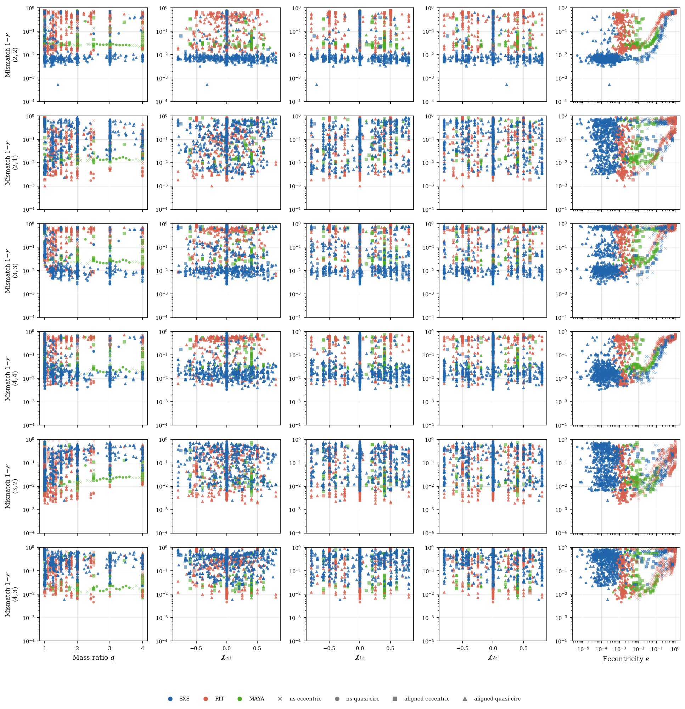
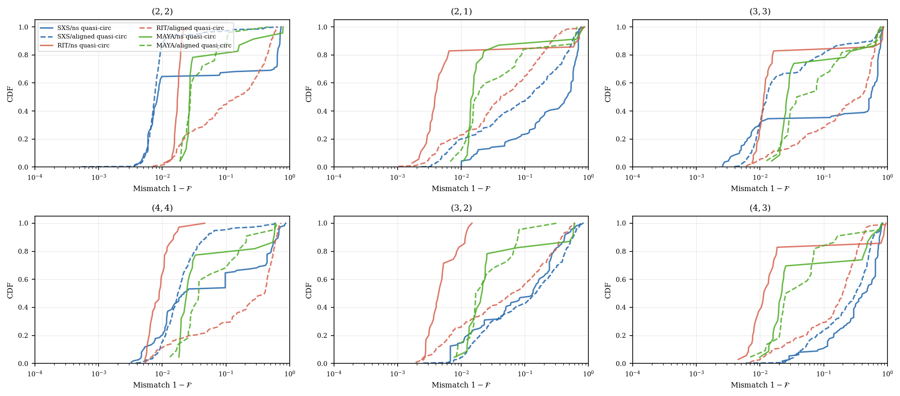
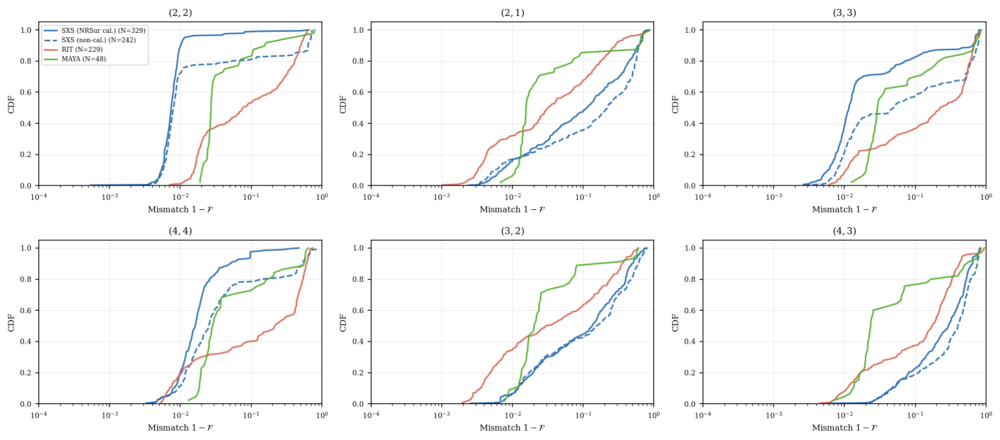
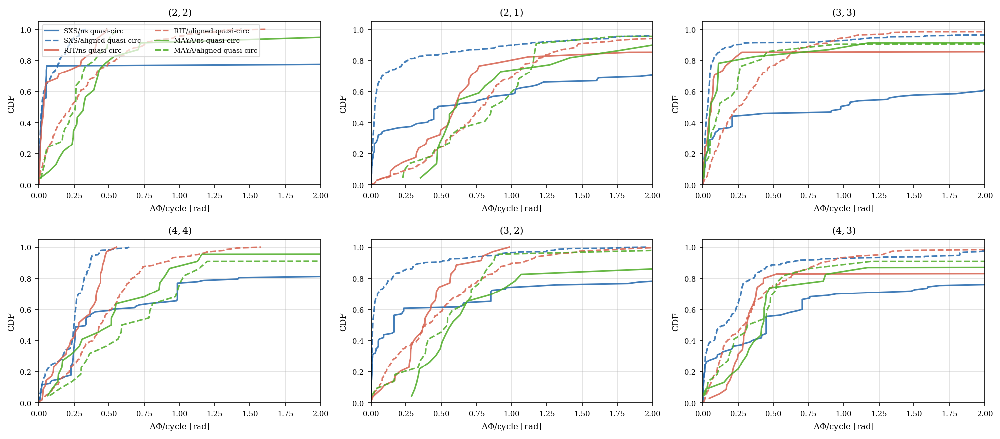
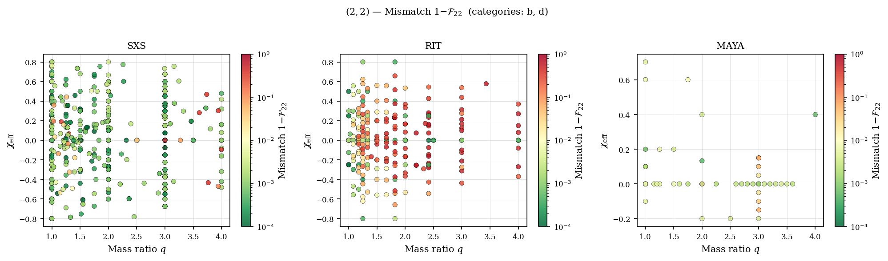

# Surrogate-Mediated Cross-Catalog Validation of Numerical Relativity Binary Black Hole Waveforms

**Prayush Kumar** _et al._

_Draft — not for circulation_

---

## Abstract

We present a systematic framework for comparing binary black hole gravitational waveforms produced by independent numerical relativity (NR) codes. By employing the NRSur7dq4 surrogate model as a common reference, our method eliminates the parameter-space mismatches that have historically obstructed direct cross-catalog comparisons. Agreement is quantified via two complementary metrics: the noise-weighted match evaluated for individual spherical harmonic modes using the Advanced LIGO design sensitivity, and the accumulated phase difference per gravitational-wave cycle. Applying this framework, we conduct a batch comparison of 1,648 non-spinning and aligned-spin simulations from the SXS, RIT, and MAYA catalogs. For the dominant $(2,2)$ mode in quasi-circular configurations, all catalogs demonstrate excellent baseline agreement, routinely achieving mismatches below $10^{-2}$. By tracking the mode-by-mode degradation as a function of initial eccentricity, we empirically confirm the surrogate's quasi-circular assumptions, demonstrating that sub-dominant harmonics (e.g., $(3,3)$ and $(4,4)$) degrade much more aggressively under eccentric modulation than the $(2,2)$ mode. Furthermore, we distinguish in-sample SXS simulations used for surrogate training from out-of-sample ones, isolating the model's interpolation boundaries. We discuss the implications of these findings for waveform modeling and parameter estimation, and outline future extensions including rigorous treatments of source-frame ambiguities and BMS supertranslations.

---

## I. Introduction

The successful simulation of binary black hole (BBH) mergers in 2005 marked a watershed moment in computational astrophysics, resolving decades of theoretical and numerical challenges. In the years immediately following these breakthroughs, numerical relativity (NR) evolved rapidly from a proof-of-principle endeavor—capable of producing only a handful of short, marginally stable waveforms—into a robust, high-precision discipline. Advances in gauge conditions, constraint-damping formulations, and scalable computational architectures enabled codes to routinely evolve BBH systems through inspiral, merger, and ringdown with exquisite accuracy.

As the first robust simulations became available, early community-wide efforts laid the foundational groundwork for integrating NR into the nascent data analysis ecosystem. The NINJA-1 project [Aylott *et al.*, Class. Quantum Grav. 26 165008 (2009)] pioneered the injection of these initial NR waveforms into simulated detector noise to evaluate the performance of early gravitational-wave search pipelines. NINJA-2 [Ajith *et al.*, Class. Quantum Grav. 29 124001 (2012)] extended this initiative by utilizing longer, more accurate waveforms to test the impact of NR errors on parameter estimation and early analytical model calibration. Subsequently, the Numerical Relativity and Analytical Relativity (NRAR) collaboration [Hinder *et al.*, Class. Quantum Grav. 31 025012 (2014)] focused on benchmarking the leading analytical waveform models of the era against a consolidated, multi-group set of NR simulations. While these landmark efforts successfully established the critical role of NR in data analysis, they largely predated the systematic, large-scale exploration of the parameter space.

Over the last decade, this continued maturation has culminated in the production of comprehensive, high-volume public waveform databases by multiple independent collaborations. Chief among these are the SXS catalog [Boyle *et al.*, Class. Quantum Grav. 36 195006 (2019)], produced by the Spectral Einstein Code (SpEC); the RIT catalog [Healy *et al.*, Phys. Rev. D 96 024031 (2017)], produced by the LazEv code; and the Georgia Tech / UT Austin MAYA catalog [Jani *et al.*, Class. Quantum Grav. 33 204001 (2016)], produced by the MayaKranc code. Each of these catalogs covers overlapping regions of the binary parameter space and is relied upon by the gravitational-wave data analysis and waveform modeling communities as an indispensable ground truth.

The practical importance of these modern, densely sampled NR catalogs cannot be overstated. Gravitational-wave detection and parameter estimation pipelines (such as PyCBC [Nitz *et al.*, PyCBC v2.4.0 (2023)], LALSuite [LIGO Scientific Collaboration, LALSuite (2023)], and Bilby [Ashton *et al.*, ApJS 241 27 (2019)]) extensively use NR waveforms as high-fidelity injection signals and as calibration targets. Furthermore, analytical waveform models — including effective-one-body (EOB) frameworks, phenomenological (IMRPhenom) families, and NR surrogate models — are directly calibrated and validated against these numerical datasets. A systematic bias or unquantified error in any particular catalog will therefore propagate directly into model calibrations and, through them, into the parameter estimation for every observed gravitational-wave event. Quantifying this bias is not merely an academic exercise: it sets a fundamental floor on the accuracy of waveform models and, ultimately, limits our ability to extract precise astrophysical and cosmological information from current and future gravitational-wave observations.

However, conducting the rigorous, direct inter-catalog cross-validation that this sensitivity demands is primarily obstructed by a fundamental difficulty: **parameter-space mismatch**. Different NR codes reach their initial conditions through distinct theoretical formalisms and numerical procedures. For example, the SXS catalog uses the Spectral Einstein Code (SpEC), which constructs initial data by solving the Extended Conformal Thin-Sandwich (XCTS) equations using multi-domain pseudospectral methods [Pfeiffer *et al.*, Comput. Phys. Commun. 152 253 (2003); Ossokine *et al.*, Phys. Rev. D 92 104028 (2015)], followed by an iterative procedure to tune orbital parameters and reduce initial eccentricity. In contrast, both the RIT (LazEv) and MAYA (MayaKranc) catalogs generally employ the moving-punctures framework, constructing initial data by solving the Bowen-York momentum constraints—commonly relying on tools like the TwoPunctures solver [Ansorg *et al.*, Phys. Rev. D 70 064011 (2004)]. Because these distinct mathematical formulations define the initial orbital separation, spin magnitudes, spin orientations, and center-of-mass velocity differently, matching the physical initial data precisely across codes is computationally expensive and never exact. As a result, for two catalog simulations $h^A(\boldsymbol{\theta}_i)$ and $h^B(\boldsymbol{\theta}_j)$ that nominally represent the same binary, the residual parameter-space distance $|\boldsymbol{\theta}_i - \boldsymbol{\theta}_j|$ can easily dominate over the intrinsic numerical errors one hopes to measure [Hannam *et al.*, Phys. Rev. D 79 084025 (2009)]. In the worst case, $\|h^A(\boldsymbol{\theta}_i) - h^B(\boldsymbol{\theta}_j)\|$ is comparable to $\|h^A(\boldsymbol{\theta}_i) - h^A(\boldsymbol{\theta}_k)\|$ for a nearby point $\boldsymbol{\theta}_k$ in the same catalog — i.e., the cross-catalog difference is dominated by the interpolation error of the catalog itself.

**Surrogate models as comparison mediators.** The advent of high-accuracy NR surrogate models opens a new avenue for cross-catalog validation. Surrogate models are fast, data-driven interpolants built directly from a set of high-fidelity NR training waveforms using reduced-order modeling techniques. Unlike traditional analytical waveform models (e.g., EOB or phenomenological models) which rely on physical approximations and fitting formulas to capture full waveform phenomenology, surrogates perform basis decomposition and empirical interpolation mode-by-mode. As a result, within their training domain, they can faithfully reproduce the original NR waveforms—complete with sub-dominant modes and complex precession dynamics—with errors comparable to the intrinsic numerical truncation errors of the training simulations themselves. 

A leading example is NRSur7dq4 [Varma *et al.*, Phys. Rev. Research 1 033015 (2019)], a fully precessing surrogate trained on 1528 SpEC simulations. Several of its technical characteristics dictate the structure of our comparative framework. First, the model interpolates waveform coefficients decomposed into spin-weight $-2$ spherical harmonics up to $\ell=4$ in a co-precessing frame, providing direct access to higher-order harmonics but strictly fixing the source-frame orientation convention to that of its SpEC training data. Second, NRSur7dq4 is trained exclusively on quasi-circular ($e=0$) binaries with mass ratios $q \le 4$ and spin magnitudes $\chi \le 0.8$. This strict domain limitation means that evaluating the surrogate on highly eccentric or boundary-case parameters probes its extrapolation behavior, allowing us to use eccentric configurations as a built-in negative control for our comparative metrics. 

Given any binary configuration $\boldsymbol{\theta}$ within the surrogate's domain, it can produce analytical outputs at those *exact* parameters, eliminating the parameter-space mismatch entirely. The direct inter-catalog comparison then reduces to measuring:

$$\|h^A(\boldsymbol{\theta}_i) - h^{\rm sur}(\boldsymbol{\theta}_i)\|,$$

where $h^{\rm sur}$ is the surrogate evaluated at the catalog's own parameters. Crucially, because NRSur7dq4 is built exclusively from a suite of SXS simulations, it acts as an analytical proxy for the SpEC codebase. Consequently, this surrogate-mediated framework strictly evaluates how well other catalogs agree with the SXS baseline, rather than providing an independent, code-agnostic metric of absolute numerical accuracy.

**Technical ambiguities in comparisons.** While the surrogate resolves the physical parameter-space mismatch, comparing two independently generated sets of waveform modes still requires careful treatment of unphysical gauge choices. Different NR codes define the orientation of their source frame $\mathbf{F}_s$ using distinct conventions—for example, aligning the $z$-axis with the instantaneous orbital angular momentum at the relaxation time versus the beginning of the simulation. This introduces an arbitrary, rigid SO(3) rotation between the two mode sets. Furthermore, the asymptotic symmetry group at null infinity $\mathcal{I}^+$ includes infinite-dimensional Bondi–Metzner–Sachs (BMS) supertranslations, meaning different waveform extraction methods naturally live in different BMS frames. In this article, we proactively address these technical difficulties by implementing a comprehensive post facto optimization framework. We systematically remove these unphysical gauge degrees of freedom by maximizing the noise-weighted waveform match over arbitrary time and phase shifts, SO(3) rigid frame rotations, and BMS supertranslations. Any residual discrepancy remaining after this optimization strictly reflects a combination of true numerical error in the NR simulation and interpolation error within the surrogate itself, which we subsequently isolate and quantify.

**Summary of Results.** Applying this framework to a batch of 1,648 non-spinning and aligned-spin waveforms across the SXS, RIT, and MAYA catalogs, we find that the dominant $(2,2)$ mode achieves excellent baseline agreement across all three catalogs for quasi-circular systems, confirming that modern, independently developed numerical relativity codes are highly consistent in this regime. By tracking the mode-by-mode degradation as a function of initial eccentricity, we empirically confirm the surrogate's quasi-circular assumptions, demonstrating a deterministic power-law escalation of the mismatch. We show that sub-dominant harmonics (e.g., $(3,3)$ and $(4,4)$) degrade much more aggressively under eccentric modulation than the $(2,2)$ mode. Furthermore, by explicitly partitioning the SXS catalog into the NRSur7dq4 calibration set and an independent test set, we isolate the surrogate's interpolation error from broader generalization limits, confirming near-perfect in-sample agreement while identifying parameter-space boundaries where out-of-sample accuracy drops.

The organization of this paper is as follows. Section~II describes the formalism for source-frame ambiguities and defines the match and phase-difference metrics. Section~III introduces the numerical relativity catalogs and describes the NRSur7dq4 surrogate. Section~IV presents results for non-spinning and aligned-spin systems, including both pilot studies and a large-scale batch comparison of 1,648 simulations. Section~V outlines our pipeline and methodology for comparing precessing-spin systems. Section~VI details planned extensions, and Section~VII concludes the paper. The details of the computational pipeline implementation are provided in the Appendix.

---

## II. Formalism

### A. Waveform Multipoles and Coordinate Ambiguities

We work with the strain decomposed at null infinity $\mathcal{I}^+$ in spin-weight $-2$ spherical harmonics in a fixed inertial source frame $\mathbf{F}_s$:

$$H(t, \iota, \phi_c) = h_+(t) - i h_\times(t) = \sum_{\ell \geq 2} \sum_{m=-\ell}^{\ell} {}^{-2}Y_{\ell m}(\iota, \phi_c)\, h_{\ell m}(t; \boldsymbol{\theta}),$$

where $\iota$ and $\phi_c$ are the polar angles of the detector in the source frame, and $\boldsymbol{\theta}$ denotes the intrinsic binary parameters (mass ratio $q$ and individual spin vectors $\boldsymbol{\chi}_{1,2}$). Each catalog simulation provides the complex time series $h_{\ell m}(t)$ in its own source frame convention.

To connect this mathematical decomposition with physical numerical relativity (NR) datasets, we review the construction of these multipoles from raw spacetime metrics. In Cauchy (3+1) spacetimes evolved by codes like SpEC (SXS), LazEv (RIT), and MayaKranc (MAYA), gravitational radiation is extracted at coordinate spheres at finite radii $R_{\rm ext}$ (typically spanning $100M$ to $400M$). Collaborations use either the Regge-Wheeler-Zerilli (RWZ) perturbative formalism or the Newman-Penrose Weyl curvature scalar $\Psi_4$ to reconstruct the gravitational-wave strain at null infinity.

The Regge-Wheeler-Zerilli (RWZ) formalism treats the outer regions of the simulation domain as a spherically symmetric Schwarzschild background of mass $M$. The metric perturbations $h_{\mu\nu} = g_{\mu\nu} - g^{\rm background}_{\mu\nu}$ are projected onto a basis of tensor spherical harmonics. By isolating the polar (even parity) and axial (odd parity) metric perturbations, one solves the Zerilli and Regge-Wheeler radial master equations, respectively. The resulting master variables directly yield the gauge-invariant strain multipoles $h_{\ell m}(t)$ at the extraction boundary. The primary advantage of the RWZ method is its gauge-invariant construction, which mitigates coordinate gauge ambiguities at finite radii. Although merging black holes typically possess spin, extraction boundaries are placed in the asymptotic far-field ($R_{\rm ext} \ge 100M$). In this regime, the leading-order spacetime metric is dominated by the total mass $M$, while spin-induced frame-dragging corrections are sub-leading (scaling as $\sim J/R_{\rm ext}^2$). Consequently, collaborations using RWZ extraction approximate the background metric at these large extraction boundaries as Schwarzschild, treating any spin-induced deviations as higher-order perturbations. 

Alternatively, collaborations extract radiation via the Newman-Penrose Weyl curvature scalar $\Psi_4$, defined by projecting the Weyl tensor $C_{\alpha\beta\gamma\delta}$ onto a null tetrad $\{l^\mu, n^\mu, m^\mu, \bar{m}^\mu\}$:

$$\Psi_4 = -C_{\alpha\beta\gamma\delta} n^\alpha \bar{m}^\beta n^\gamma \bar{m}^\delta.$$

At null infinity, the outgoing radiation encoded in $\Psi_4$ relates to the strain $h = h_+ - i h_\times$ via two time derivatives:

$$\Psi_4 = \ddot{h}_+ - i \ddot{h}_\times = \ddot{h}.$$

To construct the strain multipoles $h_{\ell m}(t)$, one must double-integrate $\Psi_{4,\ell m}(t)$ over time:

$$h_{\ell m}(t) = \lim_{R \to \infty} \int_{-\infty}^t dt' \int_{-\infty}^{t'} dt'' \, R \Psi_{4,\ell m}(t'').$$

In practice, this numerical double integration is sensitive to low-frequency noise, non-zero integration constants, and initial "junk radiation" generated by imperfect initial data. Standard integration methods can lead to severe quadratic or linear secular drifts. To combat this, collaborations use techniques such as fixed-frequency integration (FFI) [Reisswig and Pollney, Class. Quantum Grav. 28, 195015 (2011)], which filters out unphysical low-frequency modes by executing the integration in the frequency domain with a sharp high-pass cutoff $f_{\rm cutoff}$. To remove coordinate distortions at finite radii, these complex multipoles are subsequently mapped to future null infinity $\mathcal{I}^+$ either via polynomial extrapolation—fitting $h_{\ell m}(t, R_{\rm ext})$ across multiple concentric extraction spheres in powers of $1/R_{\rm ext}$—or via Cauchy-Characteristic Extraction (CCE), which characteristic-evolves the worldtube data along null hypersurfaces to $\mathcal{I}^+$.

While computing $\Psi_4$ is algebraically straightforward, the RWZ formalism is often preferred due to its gauge invariance and mitigation of integration drift. Specifically, $\Psi_4$ requires an orthonormal null tetrad on the extraction sphere; coordinate shift stretching and lapse slicing warp this tetrad, contaminating $\Psi_4$ with spurious coordinate-gauge dynamics that decay slowly as $1/R_{\rm ext}$. The RWZ master variables, however, are strictly gauge-invariant linear perturbations under the Schwarzschild background, effectively filtering out local coordinate slicing effects. Furthermore, the RWZ variables relate directly to the metric perturbation $h_{\mu\nu}$, bypassing the error-prone double time integration required for $\Psi_4$. Once the Zerilli ($\Psi_{\rm Z}$) and Regge-Wheeler ($\Psi_{\rm RW}$) variables are computed, the strain is recovered algebraically:
    
$$h_{\ell m}(t) \propto \Psi_{\rm Z}(t) + i \Psi_{\rm RW}(t).$$
    
Solving the associated 1D radial wave equations adds negligible computational cost compared to evolving the full 3D bulk Einstein equations. Thus, while $\Psi_4$ naturally generalizes to rotating Kerr boundaries (via the Teukolsky formalism), the RWZ formalism remains highly favored for its robust, integration-free reconstruction of the strain at finite coordinate boundaries.

These diverse numerical pipelines inevitably introduce coordinate and asymptotic gauge ambiguities. First, because there is no coordinate-independent standard to align the orthonormal spatial coordinate triads $\{\mathbf{e}_x, \mathbf{e}_y, \mathbf{e}_z\}$ representing the source frame, different codes employ differing initial gauge alignments. For example, moving-puncture codes align axes at $t=0$ using the puncture separation and momentum vectors, whereas SpEC aligns the $z$-axis with the orbital angular momentum at the post-junk relaxation time. Furthermore, the coordinate shift vector $\beta^i$ evolves dynamically under different gauge conditions (e.g., damped harmonic vs. Gamma-driver puncture shift gauges), causing coordinate frames to rotate relative to one another during the long dynamical inspiral. Second, the retarded Bondi time coordinate $u$, which labels future null cones, is affected by direction-dependent time-slicing (lapse $\alpha$) histories and null cone warping, dragging direction-dependent coordinate clock offsets directly into the extracted asymptotic strain. These physical coordinate offsets and slicing histories naturally manifest as rigid $\mathrm{SO}(3)$ source-frame rotations and infinite-dimensional Bondi-Metzner-Sachs (BMS) supertranslations, preventing any direct comparison without first systematically aligning the coordinate frames.

### B. Gauge Transformations: Source-Frame Rotations and BMS Supertranslations

To compare waveforms from independent catalogs, we must mathematically formalize these coordinate and asymptotic gauge transformations and apply them to the multipole time series.

**Source-Frame Rotations.** Let $\mathbf{F}_C$ (catalog frame) and $\mathbf{F}_S$ (surrogate frame) be related by a rigid rotation $R \in \mathrm{SO}(3)$, as illustrated in Fig.~\ref{fig:coordinate_frames_rotation}. Under this rotation, the multipoles transform and mix mode-by-mode via the Wigner $D$-matrices:

$$h^{S,\mathrm{rot}}_{\ell m}(t) = \sum_{m'=-\ell}^{\ell} h^S_{\ell m'}(t)\, D^\ell_{m' m}(R).$$

Integrating a time shift $t_c$ and a coalescence phase shift $\phi_c$, the complete source-frame transformation is given by:

$$\boxed{h^S_{R,\ell m}(t;\, t_c, \phi_c, R) = e^{-im\phi_c} \sum_{m'} h^S_{\ell m'}(t - t_c)\, D^\ell_{m' m}(R).}$$

Maximizing the match over $(t_c, \phi_c, R)$ systematically isolates the physical mismatch from all rigid coordinate frame and time-translation offsets.

{#fig:coordinate_frames_rotation}

**BMS Supertranslations.** Beyond rigid rotations, the full BMS symmetry group at $\mathcal{I}^+$ introduces supertranslations, which represent direction-dependent retarded time translations of the form $u \to u - \alpha(\theta,\phi)$. Expanding the slicing function in terms of ordinary spherical harmonics, $\alpha(\theta,\phi) = \sum_{j,k} \alpha_{jk}\, Y_{jk}(\theta,\phi)$, the transformed multipoles to first order in the supertranslation coefficients $\alpha_{jk}$ are given by:

$$\boxed{h'_{\ell m}(u) = h_{\ell m}(u) - \sum_{j,k,p,q} \alpha_{jk}\, \mathcal{G}^{\ell m}_{jk,pq}\, \dot{h}_{pq}(u),}$$

where the coefficients $\mathcal{G}^{\ell m}_{jk,pq} = \int_{S^2} {}^{-2}Y^*_{\ell m}\, Y_{jk}\, {}^{-2}Y_{pq}\, d\Omega$ are Gaunt integrals. In this expansion, the $j=0$ term corresponds to a uniform time translation $t_c$ (already captured in the $\mathrm{SO}(3)$ optimization), the $j=1$ terms correspond to center-of-mass spatial translations, and the $j \geq 2$ terms represent proper infinite-dimensional supertranslations. Systematically maximizing the waveform match over these supertranslation coefficients removes the residual slicing distortions introduced by the Cauchy coordinate gauges and wave extraction boundaries.

### C. Waveform Agreement Metrics

To quantitatively compare the physical content of the aligned waveforms, we employ two complementary agreement metrics that probe different aspects of waveform coherence.

**Noise-Weighted Match.** The standard detector-response comparison utilizes a noise-weighted inner product. For two complex strain time series $h_1(t)$ and $h_2(t)$, the inner product is defined as:

$$\langle h_1 | h_2 \rangle = 4\,\mathrm{Re} \int_{f_{\rm min}}^{f_{\rm max}} \frac{\tilde{h}_1(f)\,\tilde{h}_2^*(f)}{S_n(f)}\, df,$$

where $S_n(f)$ is the one-sided power spectral density (PSD) of the detector noise. The faithfulness (or match) is then computed as the normalized inner product:

$$\mathcal{F}(h_1, h_2) = \frac{\langle h_1 | h_2 \rangle}{\sqrt{\langle h_1 | h_1 \rangle \langle h_2 | h_2 \rangle}},$$

which is maximized over time and phase shifts by PyCBC's `match()` function. Throughout this study, we utilize the Advanced LIGO zero-detuning high-power design curve as $S_n(f)$, and apply this metric independently to each mode. For a given mode $(\ell, m)$, we scale the lower frequency cutoff as:

$$f_{\rm lower}^{(\ell m)} = \frac{|m|}{2}\, f_{\rm lower}^{(22)},$$

accounting for the fact that the gravitational-wave frequency of the $(\ell,m)$ harmonic scales as $|m|$ times the orbital frequency, while the $(2,2)$ mode frequency corresponds to twice the orbital frequency.

**Phase Difference per Cycle.** The match metric alone can be insensitive to slow, secular phase drifts that accumulate over many cycles, as the optimization over $t_c$ and $\phi_c$ can partially absorb phase biases. To directly expose these drifts, we compute the average rate of phase accumulation error:

$$\Delta\Phi/{\rm cycle} = \frac{|\Delta\Phi_{\rm NR} - \Delta\Phi_{\rm sur}|}{N_{\rm cyc}^{\rm NR}}\quad [\mathrm{rad/cycle}],$$

where $\Delta\Phi = |\phi(t_{\rm end}) - \phi(t_{\rm start})|$ is the total accumulated phase over the common time window of the two waveforms, $\phi(t) = \arg[h_{\ell m}(t)]$ is the unwrapped phase of the complex mode, and $N_{\rm cyc}^{\rm NR} = \Delta\Phi_{\rm NR} / (2\pi)$ is the total number of gravitational-wave cycles in the NR waveform. Unlike the match, this metric is free from time/phase maximization. Together, the noise-weighted match (sensitive to amplitude and phase coherence near merger) and the phase difference per cycle (measuring the integrated phase budget over the long inspiral) provide a robust, dual-diagnostic framework.

---

## III. Waveform Catalogs and Surrogate Model

### A. Numerical Relativity Catalogs and Simulation Classification

To structure the comparison across catalogs, we classify every simulation according to its spin geometry and orbital eccentricity.  Let $\chi_\perp = \sqrt{\chi_{1x}^2 + \chi_{1y}^2 + \chi_{2x}^2 + \chi_{2y}^2}$ be the total in-plane spin magnitude and $e$ be the reference eccentricity from the catalog metadata.  We define six categories:

| Category | Name | Formal conditions |
|---|---|---|
| (a) | Non-spinning eccentric | $\chi_\perp < \varepsilon_\chi$, $|\chi_{1z}| + |\chi_{2z}| < \varepsilon_\chi$, $e > \varepsilon_e$ |
| (b) | Non-spinning quasi-circular | $\chi_\perp < \varepsilon_\chi$, $|\chi_{1z}| + |\chi_{2z}| < \varepsilon_\chi$, $e \leq \varepsilon_e$ |
| (c) | Aligned-spin eccentric | $\chi_\perp < \varepsilon_\chi$, $|\chi_{1z}| + |\chi_{2z}| \geq \varepsilon_\chi$, $e > \varepsilon_e$ |
| (d) | Aligned-spin quasi-circular | $\chi_\perp < \varepsilon_\chi$, $|\chi_{1z}| + |\chi_{2z}| \geq \varepsilon_\chi$, $e \leq \varepsilon_e$ |
| (e) | Precessing eccentric | $\chi_\perp \geq \varepsilon_\chi$, $e > \varepsilon_e$ |
| (f) | Precessing quasi-circular | $\chi_\perp \geq \varepsilon_\chi$, $e \leq \varepsilon_e$ |

with thresholds $\varepsilon_\chi = 0.001$ and $\varepsilon_e = 0.005$.

**Catalog counts.** Table IV shows both the total simulation count in each catalog and the number of simulations within the NRSur7dq4 prior volume ($q \leq 4$, $|\chi_{1,2}| \leq 0.8$, and $e = 0$) shown in parentheses. For the SXS catalog, the parenthesis additionally includes the number of simulations used directly for surrogate calibration, using the format: $N_{\rm total}~(N_{\rm calibration}, N_{\rm prior})$ after metadata filtering.

**Table IV. Total simulation counts, calibration counts (SXS only), and counts within the NRSur7dq4 prior volume (shown in parentheses).**

| Category | SXS | RIT | MAYA |
|---|---|---|---|
| (a) non-spinning eccentric | 206 (0, 0) | 499 (0) | 74 (0) |
| (b) non-spinning quasi-circular | 177 (60, 123) | 54 (35) | 34 (25) |
| (c) aligned eccentric | 21 (0, 0) | 231 (0) | 117 (0) |
| (d) aligned quasi-circular | 687 (282, 464) | 541 (199) | 40 (26) |
| (e) precessing eccentric | 30 (0, 0) | 117 (0) | 303 (0) |
| (f) precessing quasi-circular | 3043 (1389, 1962) | 437 (25) | 67 (49) |
| **Total (all categories)** | **4164 (1731, 2549)** | **1879 (259)** | **635 (100)** |

The distribution of simulations reflects the distinct parameter-space exploration strategies of the respective collaborations, as detailed in the catalog metadata (`nr-catalog-tools/catalog_organization`). 

The SXS catalog is primarily composed of precessing quasi-circular configurations (category f; 3,043 total, 1,962 in-prior), providing the dense parameter-space coverage required for training and validating quasi-circular precessing models such as `NRSur7dq4` (which utilizes 1,389 of these simulations for calibration). Non-spinning eccentric (a) and aligned quasi-circular (d) configurations have moderate representation (206 and 687 total, respectively). Conversely, eccentric precessing (category e; 30 total) and aligned eccentric (category c; 21 total) configurations are less represented in the current SXS dataset.

The RIT catalog exhibits a more uniform distribution across the defined subcategories. It provides the largest sample of both non-spinning eccentric (category a; 499 total) and aligned-spin eccentric (category c; 231 total) configurations. Alongside its aligned quasi-circular (category d; 541 total) and precessing quasi-circular (category f; 437 total) populations, the RIT catalog serves as a comprehensive dataset for evaluating eccentric, non-spinning, and aligned-spin waveforms.

The MAYA catalog is strongly specialized toward precessing-eccentric configurations (category e; 303 total), reflecting a focused investigation of this specific parameter regime using the MayaKranc code. Quasi-circular aligned-spin (category d; 40 total) and non-spinning quasi-circular (category b; 34 total) systems are correspondingly less represented in this dataset.

**NRSur7dq4 calibration sub-classification.** A key feature of the SXS catalog is that 1,731 of its simulations were used as training data for the NRSur7dq4 surrogate~\cite{nrsur7dq4}: 60 in category (b), 282 in category (d), and 1,389 in category (f).  All calibration simulations are quasi-circular ($e = 0$) by the surrogate's training design.  Categories (a), (c), and (e) contain no calibration simulations.  This stratification is recorded in the `catalog_organization/sxs_classification.json` file as a per-simulation boolean flag, propagated into the results CSV, and used to split the SXS analysis into calibration (in-sample) and non-calibration (out-of-sample) subsets.

**Rationale for processing categories a–d first.** For all systems in categories (a)–(d), the in-plane spin components $\chi_\perp = 0$ by construction, so both the NR simulation and the NRSur7dq4 output have their orbital angular momentum aligned with the $z$-axis of the source frame.  There is therefore no SO(3) frame rotation to be optimized: the phase maximization in `pycbc.filter.match()` already absorbs the residual rotation about $z$.  This makes categories (a)–(d) the natural starting point for the systematic comparison.  Categories (e) and (f) require a full SO(3) optimization (Section~V) and are reserved for a later analysis step.

### B. NRSur7dq4

NRSur7dq4 [Varma *et al.*, Phys. Rev. Research 1 033015 (2019)] is a fully precessing surrogate model trained on a dense grid of 1528 SpEC simulations at mass ratios $q = m_1/m_2 \in [1, 4]$ and spin magnitudes $|\boldsymbol{\chi}_{1,2}| \leq 0.8$. It provides all mode coefficients up to $\ell = 4$ (excluding $(5,5)$) as complex numpy arrays $h_{\ell m}$ in dimensionless $r h_{\ell m}/M$ units — following the standard spin-weight $-2$ spherical harmonic convention used by `WaveformModes.get_mode()`, so no convention conversion is required, only amplitude scaling and time rescaling. The model accepts:

- **Mass ratio** $q = m_1/m_2 \geq 1$ (PyCBC / SpEC convention)
- **Dimensionless spins** $\boldsymbol{\chi}_{1,2}$ specified at a reference epoch controlled by the `f_ref` parameter (see below)
- **Reference frequency** $f_{\rm ref}$ in cycles/$M$: $f_{\rm ref} = M_{\rm tot} \cdot f_{\rm GW}^{(22)} \cdot G M_\odot / c^3$; sets the epoch at which the input spin components are defined
- **Starting frequency** $f_{\rm low}$: controls waveform truncation only; per the gwsurrogate documentation, `f_low=0` is recommended for NRSur7dq4, which returns the full waveform from the surrogate's natural minimum
- **Time step** $dt$ in dimensionless units $dt/M$

Two cases arise depending on whether the NR waveform starts before or after the surrogate's minimum training frequency ($M\Omega \approx 0.0161$ at the parameters studied here):

1. **NR shorter than surrogate** ($f_{\rm lower}^{\rm NR} > f_{\rm min}^{\rm sur}$): we pass `f_low=0` and `f_ref`$= M_s \cdot f_{\rm lower}^{\rm NR}$. The surrogate backward-evolves the spins from the NR epoch to its natural start, giving the full common waveform.
2. **NR longer than surrogate** ($f_{\rm lower}^{\rm NR} < f_{\rm min}^{\rm sur}$): the surrogate domain cannot reach the NR starting frequency, so `f_ref` is clipped to the surrogate minimum. For the aligned-spin and non-spinning systems studied here, the spin components do not precess, so the metadata spin values are valid at any epoch and no spin-epoch error is introduced. For a general precessing system, this case would require extracting the instantaneous spins from NR dynamics at $f_{\rm min}^{\rm sur}$.

We adjust the lower cutoff of the match integral to $f_{\rm lower}^{\rm match} = \max(f_{\rm lower}^{\rm NR}, f_{\rm lower}^{\rm sur})$, so that neither waveform is penalized for having support outside the other's frequency band.

### C. Parameter Extraction

Source parameters are extracted from catalog metadata via `nrcatalogtools.CatalogBase.get_parameters()`, which returns a PyCBC-compatible dictionary: `mass1`, `mass2`, `spin1x/y/z`, `spin2x/y/z`, and `f_lower`. For SXS simulations, `f_lower` is defined as

$$f_{\rm lower} = \frac{M\Omega_{\rm NR}}{\pi \cdot M_{\rm tot} \cdot (G M_\odot / c^3)},$$

which equals the $(2,2)$-mode gravitational-wave frequency at the NR relaxation time. This same value is passed as `f_ref` (in cycles/$M$: $f_{\rm ref} = f_{\rm lower} \cdot M_s$) to NRSur7dq4, which uses it to set the spin reference epoch. The waveform start is controlled separately via `f_low=0`. Because `nrcatalogtools` extracts spin components at the relaxation time and `f_ref` is set to the corresponding frequency, these two epochs are exactly consistent — no separate spin-epoch remapping is required, provided $f_{\rm lower}^{\rm NR} \geq f_{\rm min}^{\rm sur}$. When $f_{\rm lower}^{\rm NR} < f_{\rm min}^{\rm sur}$ (NR waveform longer than the surrogate), `f_ref` is clipped to the surrogate domain minimum.

### D. Mode Extraction and Scaling

NR modes are extracted as complex physical-unit time series via `WaveformModes.get_mode(ell, em, total_mass, distance, delta_t_seconds)`, which returns a PyCBC `TimeSeries` with epoch set so that $t = 0$ corresponds to the peak of the $(2,2)$ amplitude. The surrogate modes are scaled from dimensionless units to physical units as

$$h_{\ell m}^{\rm phys}(t) = h_{\ell m}^{\rm sur}(t/M_s) \times \frac{G M_{\rm tot}}{c^2 D},$$

where $M_{\rm tot}$ is the total mass in kg, $M_s = G M_{\rm tot} / c^3$ is the total mass in seconds, and $D$ is the luminosity distance in meters. All comparisons in this study use $M_{\rm tot} = 40\,M_\odot$ and $D = 1\,{\rm Mpc}$.

The per-mode match uses the real part $\mathrm{Re}[h_{\ell m}]$, padded to the next power-of-two length and noise-weighted with a freshly constructed PSD at the matching frequency resolution.

---

## IV. Results: Non-spinning and Aligned-spin BBH

### A. Pilot Studies
We first evaluate NRSur7dq4 against a small set of four SXS pilot simulations selected to probe two orthogonal axes of parameter space: mass ratio ($q = 1$ vs. $q = 2$) and spin ($\chi = 0$ vs. aligned spin $\chi_{1z} \approx 0.5$). These systems are non-precessing, so the orbital angular momentum remains aligned with the z-axis of the source frame. For this initial comparison, we evaluate all modes from the set $\{(2,2), (2,1), (3,3), (4,4), (5,5), (3,2), (4,3)\}$; note that the $(5,5)$ mode is unavailable from NRSur7dq4 ($\ell_{\rm max}=4$) and accordingly appears as N/A. Table I summarizes the simulation parameters.

**Table I. Simulation parameters.**

| Simulation | $q$ | $\chi_{1z}$ | $\chi_{2z}$ | $f_{\rm lower}^{\rm NR}$ [Hz] | $f_{\rm lower}^{\rm match}$ [Hz] |
|---|---|---|---|---|---|
| SXS:BBH:0001 | 1.00 | 0.00 | 0.00 | 19.8 | 26.1 (sur. clipped) |
| SXS:BBH:0005 | 1.00 | +0.50 | 0.00 | 19.8 | 26.7 (sur. clipped) |
| SXS:BBH:0169 | 2.00 | 0.00 | 0.00 | 29.1 | 29.1 |
| SXS:BBH:0162 | 2.00 | +0.60 | 0.00 | 28.8 | 28.8 |

For SXS:BBH:0001 and SXS:BBH:0005, the NR simulation starts at $\sim 20$ Hz but NRSur7dq4's minimum training extent at these parameters corresponds to $\sim 26$–$27$ Hz. The match lower cutoff is raised accordingly so that neither waveform is penalized for frequency content outside the other's support.

**Table II. Per-mode match $\mathcal{F}$ for all four simulations.**

| Mode | 0001 ($q$=1, ns) | 0005 ($q$=1, spin) | 0169 ($q$=2, ns) | 0162 ($q$=2, spin) |
|---|---|---|---|---|
| (2,+2) | 0.9940 | 0.9933 | 0.9947 | 0.9931 |
| (2,+1) | — † | **0.9966** | 0.9513 | 0.350 ‡ |
| (3,+3) | — † | 0.9548 | 0.9968 | 0.9844 |
| (4,+4) | 0.902  | 0.9886 | 0.9965 | 0.9778 |
| (5,+5) | N/A | N/A | N/A | N/A |
| (3,+2) | 0.9932 | 0.9924 | 0.9581 | **0.569 ‡** |
| (4,+3) | — † | 0.9744 | 0.9596 | 0.406 ‡ |

† Near-zero by $q = 1$, $\chi = 0$ symmetry; match value is numerically meaningless.  
‡ Anomalous; discussed in Section IV.C.

**Table III. Phase difference per GW cycle $\Delta\Phi/{\rm cycle}$ [rad] and number of NR cycles $N_{\rm cyc}$.**

| Mode | 0001 (q=1,ns) | 0005 (q=1,spin) | 0169 (q=2,ns) | 0162 (q=2,spin) |
|---|---|---|---|---|
| (2,+2) | 0.051 (42 cyc) | 0.004 (44 cyc) | 0.005 (43 cyc) | 0.005 (47 cyc) |
| (2,+1) | — †            | 0.049 (25 cyc) | 0.005 (24 cyc) | 0.025 (26 cyc) |
| (3,+3) | — †            | 0.045 (67 cyc) | 0.019 (65 cyc) | 0.001 (71 cyc) |
| (4,+4) | 0.983 (71 cyc) | 0.309 (89 cyc) | 0.334 (86 cyc) | 0.240 (95 cyc) |
| (5,+5) | — | — | — | — |
| (3,+2) | 0.163 (43 cyc) | 0.004 (44 cyc) | 0.003 (43 cyc) | 0.004 (47 cyc) |
| (4,+3) | — †            | 0.236 (69 cyc) | 0.001 (65 cyc) | 0.004 (71 cyc) |

The dominant $(2,2)$ mode agrees well across all configurations. Matches of 0.993–0.995 and phase errors of 0.004–0.051 rad/cycle confirm that `NRSur7dq4` faithfully reproduces the SXS $(2,2)$ mode. For $q=2$, the slightly lower match in the spinning case (0.9931) compared to the non-spinning case (0.9947) is consistent with spin-induced amplitude corrections near merger. The phase error remains below 0.006 rad/cycle for all $q=2$ cases, indicating that residual mismatch is dominated by amplitude differences rather than phase drift.

The physical relevance of sub-dominant modes depends on whether the underlying binary symmetries are broken. For an equal-mass, non-spinning binary ($q = 1$, $\chi = 0$), all odd-$m$ modes—specifically $(2,1)$, $(3,3)$, and $(4,3)$—vanish identically by exchange symmetry. The reported matches of these modes for SXS:BBH:0001 (0.28–0.35) merely reflect numerical noise. Once this symmetry is broken by either unequal masses ($q = 2$) or non-zero spin ($\chi_{1z} = 0.5$), these modes acquire physical amplitudes, and the surrogate reproduces them with matches exceeding 0.95 in nearly all cases.

Adding aligned spin ($\chi_{1z} = 0.5$) to an equal-mass binary preferentially excites the $(2,1)$ mode (match 0.997, $\Delta\Phi = 0.049$ rad/cycle) over the $(3,3)$ mode (match 0.955). This reflects the underlying physics: the $(2,1)$ mode is sourced dominantly by the mass-weighted spin-orbit coupling, whereas the $(3,3)$ mode requires mass-ratio asymmetry for strong excitation.

We observe anomalously low agreement for the $(3,2)$ mode in SXS:BBH:0162 ($q=2, \chi_{1z}=0.6$), yielding $\mathcal{F}_{(3,2)} = 0.569$ despite excellent matches for other primary modes ($\geq 0.98$). Crucially, the phase error for this mode is only 0.004 rad/cycle, indicating that the mismatch is driven by an amplitude discrepancy rather than phase deviation. The $(3,2)$ mode exhibits a near-cancellation between mass-ratio and spin-orbit sourced terms at certain spin configurations. Small errors in the surrogate's relative weighting of these contributions can produce large fractional amplitude errors, especially near a local minimum in the interpolation. Similar effects likely explain the reduced matches of the $(4,3)$ mode ($\mathcal{F} = 0.406$) and $(2,1)$ mode ($\mathcal{F} = 0.350$) for SXS:BBH:0162, as well as the $(3,2)$ mode for SXS:BBH:0169 ($\mathcal{F} = 0.958$).

The $(4,4)$ mode systematically exhibits the largest phase accumulation error among non-vanishing modes, with $\Delta\Phi_{(4,4)}/{\rm cycle}$ ranging from 0.24 to 0.98 rad/cycle. Given that the $(4,4)$ mode oscillates at roughly twice the frequency of the $(2,2)$ mode, a factor of two increase in $\Delta\Phi/{\rm cycle}$ would be expected for a constant relative phase error. The observed factor of $\sim$20–100 suggests that the surrogate's $\ell = 4$ sector possesses larger fractional phase-integration error, likely because fewer NR training waveforms were available to constrain this sector relative to $\ell = 2$.

These results highlight the complementary nature of the phase metric and the noise-weighted match. For example, in SXS:BBH:0001, the $(3,2)$ mode yields an excellent match of 0.993, yet exhibits a significant phase error of $\Delta\Phi_{(3,2)}/{\rm cycle} = 0.163$ rad. The match is insensitive to this slowly accumulating drift because the maximization over time shift partially absorbs it. Conversely, the $(2,2)$ mode of SXS:BBH:0162 has near-perfect phase agreement (0.005 rad/cycle) but a slightly reduced match (0.993), indicating amplitude differences near merger. Employing both metrics provides a robust evaluation of waveform agreement.

### B. Batch Comparison of Non-Spinning and Aligned-Spin Systems

We extend the pilot analysis to all simulations in categories (a)–(d) across the SXS, RIT, and MAYA catalogs that fall within the NRSur7dq4 prior volume.  After metadata filtering, this yields 774 SXS, 686 RIT, and 188 MAYA simulations, for a total of 1,648 waveform comparisons.  We focus our discussion on the quasi-circular subsets (categories b and d) where the surrogate is expected to perform best, but report all categories.

**Table V. Per-mode match statistics (median / 10th percentile) for quasi-circular systems (categories b+d).**

| Mode | SXS (N=579) | RIT (N=229) | MAYA (N=49) |
|---|---|---|---|
| $(2,2)$ | 0.9923 / 0.9496 | 0.9231 / 0.4941 | 0.9728 / 0.8439 |
| $(2,1)$ | 0.8541 / 0.3739 | 0.9676 / 0.7152 | 0.9843 / 0.3775 |
| $(3,3)$ | 0.9865 / 0.2926 | 0.7710 / 0.3241 | 0.9707 / 0.3120 |
| $(4,4)$ | 0.9819 / 0.8768 | 0.7829 / 0.3895 | 0.9709 / 0.4383 |
| $(3,2)$ | 0.8580 / 0.4615 | 0.9700 / 0.6452 | 0.9794 / 0.7781 |
| $(4,3)$ | 0.6711 / 0.2989 | 0.8248 / 0.5763 | 0.9765 / 0.4615 |

#### B.1 Quasi-circular Systems

The SXS $(2,2)$ match distribution is concentrated near unity, with a median of 0.9923 and a 10th percentile of 0.9496. The tail below 0.95 consists primarily of short NR simulations with few cycles and configurations at high mass ratios and high spins near the boundary of the `NRSur7dq4` prior domain.

The RIT $(2,2)$ distribution is broader, with a median of 0.9231 and a 10th percentile of 0.494. The cumulative distribution function (CDF, Figure 3a, 5) reveals a bimodal structure featuring a high-match peak near $\mathcal{F} \sim 0.99$ and a low-match population extending below 0.5. As shown in Figure 1, the low-match RIT simulations are concentrated at high $|\chi_{\rm eff}|$ and $q \sim 4$. Because these fall near the boundary of the surrogate's training domain, increased phase mismatch is expected.

The MAYA $(2,2)$ distribution is intermediate, with a median of 0.9728 and a 10th percentile of 0.8439. Although the small sample size limits statistical precision, the data suggests systematically lower matches compared to SXS at similar parameters.

We also examine the impact of calibration data. `NRSur7dq4` was trained on 342 of the 579 SXS quasi-circular simulations analyzed here. The calibration subset has a median $(2,2)$ match of 0.9926 and a 10th percentile of 0.9899, consistent with the surrogate's design to interpolate its training set with near-zero error. The non-calibration subset has a similar median (0.9919) but a much wider lower tail, with a 10th percentile of 0.360. This indicates that while the surrogate generalizes well overall, there remain regions where the sparse training grid limits interpolation accuracy.

Sub-dominant mode behavior varies substantially across catalogs, as seen in Table V and Figures 1, 3b, and 5. For the SXS catalog, the median matches for $(3,3)$ (0.987) and $(4,4)$ (0.982) are high, whereas the $(4,3)$ median is lower (0.671) and the odd-$m$ modes $(2,1)$ and $(3,2)$ show wide spreads. This wide spread reflects the binary-symmetry mechanism: for equal-mass, non-spinning systems, odd-$m$ modes vanish, rendering their matches numerically ill-defined.

The RIT catalog shows higher median matches for $(2,1)$ (0.968) and $(3,2)$ (0.970) than SXS, but lower medians for $(3,3)$ (0.771) and $(4,4)$ (0.783). The $(3,3)$ mode in RIT exhibits an extended low-match tail, indicating systematic phase error distinct from the $(2,2)$ bimodal structure.

The MAYA catalog achieves median matches above 0.970 for all six modes. While the sample size is small, this suggests that MAYA waveforms in this subset are clustered in parameter regions where `NRSur7dq4` interpolates accurately.

The phase-difference metric provides additional diagnostic insights (Figures 2a, 2b). For quasi-circular SXS systems, the $(2,2)$ phase difference has a median of 0.01 rad/cycle, which is well below the threshold of 0.1 rad/cycle typically considered acceptable for parameter estimation. The $(4,4)$ mode exhibits the largest phase errors (median $\sim$0.3 rad/cycle), consistent with the results in Section IV.B and the sparser `NRSur7dq4` training in the $\ell = 4$ sector. The RIT and MAYA catalogs show systematically larger phase differences for several modes, suggesting that their match deficits in Table V are partially attributable to cumulative phase error rather than pure amplitude discrepancy.

#### B.2 Effect of eccentricity

We analyze the quantitative dependence of mismatch and phase errors on orbital eccentricity across the catalogs. Figure 1 maps the broad mode-by-mode landscape, and our focused analysis on eccentricity reveals systematic catalog dependencies.

For low initial eccentricity ($e < 0.005$), we find near-perfect agreement with the quasi-circular `NRSur7dq4` surrogate. The dominant $(2,2)$ mode for SXS waveforms yields mismatches below $10^{-3}$ to $10^{-4}$. Similar limits are recovered for the RIT and MAYA catalogs ($< 10^{-2}$ for $e < 10^{-3}$), demonstrating that cross-catalog numerical differences are sub-dominant to surrogate interpolation errors in the quasi-circular regime when waveforms are time-aligned.

As initial eccentricity increases above 0.005, mismatch escalates according to a power law across all catalogs and harmonics. From $e=0.005$ to $0.05$, the $(2,2)$ mode mismatch grows by over two orders of magnitude. This degradation reflects the surrogate's limitation: restricted to a quasi-circular prior, it cannot capture eccentric modulations. Higher-order harmonics, such as $(3,3)$ and $(4,4)$, degrade more rapidly than the $(2,2)$ mode because eccentric modulation of the orbital frequency is amplified by a factor of $m$.

The phase difference per cycle remains tightly constrained to $< 0.05$ rad/cycle for $e < 0.005$. However, as $e$ increases, the discrepancy scales up to $1.0$ rad/cycle for $e \ge 0.05$. This increase is a direct consequence of unmodeled periastron precession and radial frequency oscillations. The consistency of this behavior across catalogs indicates that modern NR codes robustly capture these eccentric dynamics, whereas the quasi-circular surrogate systematically and predictably deviates from them.

---

## V. Results: Spin-precessing BBH

For precessing-spin systems (categories e and f), the intrinsic spin vectors are no longer aligned with the orbital angular momentum. As a result, both the spin directions and the orbital plane precess dynamically throughout the inspiral. This introduces two major challenges for cross-catalog comparison: (1) spin-epoch inconsistency, where different codes define the reference spins at different epochs, and (2) coordinate-frame offsets, resulting in arbitrary rigid rotations between the extracted NR modes and the surrogate's output frame.

To address these challenges, we have developed a precessing comparison pipeline that synchronizes the physical states of the NR simulation and the surrogate model at a common epoch, followed by a post-facto optimization over the remaining gauge degrees of freedom.

### A. Precessing Comparison Pipeline

The precessing comparison workflow begins by loading the NR waveform and extracting the mass ratio $q$ and dimensionless spin vectors $\vec{\chi}_{1,2}$ from the catalog metadata. If the in-plane spin components satisfy $\chi_{1\perp} > 10^{-4}$ or $\chi_{2\perp} > 10^{-4}$, the precessing pipeline and $SO(3)$ rotation optimization are activated.

For precessing binaries, we extract the time-dependent spin vectors and coordinate frame trajectories—specifically the orbital separation $\vec{r}_{\rm sep}$ and angular momentum $\vec{L}$—from the horizon dynamics (e.g., `Horizons.h5` in the SXS catalog). We establish a common epoch near the start of the surrogate's training window, typically $t_{\rm target} = t_{\rm peak} - 4300M$. At this epoch, we rotate the inertial-frame spins into the coprecessing frame:

$$\vec{\chi}_{\rm cop} = R\,\vec{\chi}_{\rm inertial}, \quad \text{where } R = \begin{pmatrix} \hat{n} \\ \hat{\lambda} \\ \hat{L} \end{pmatrix},$$

with $\hat{n} = \vec{r}_{\rm sep}/|\vec{r}_{\rm sep}|$ pointing from the lighter to the heavier black hole, $\hat{L} = (\vec{r}_{\rm sep} \times \dot{\vec{r}}_{\rm sep})/|\vec{r}_{\rm sep} \times \dot{\vec{r}}_{\rm sep}|$, and $\hat{\lambda} = \hat{L} \times \hat{n}$. This transformation aligns the coordinate system at $t_{\rm target}$ with the surrogate's input convention.

The epoch-aligned coprecessing spins are then supplied to `NRSur7dq4`. The reference frequency $f_{\rm ref}$ is set to the dimensionless gravitational-wave frequency of the $(2,2)$ mode at $t_{\rm target}$, computed via the phase derivative:

$$f_{\rm ref} = \frac{|\dot\phi_{22}|}{2\pi}.$$

The surrogate internally backward-evolves the spin dynamics from this reference epoch to the starting frequency. Finally, the generated surrogate modes are scaled to physical units and time-shifted such that $t = 0$ coincides with the peak of the $(2,2)$ amplitude envelope, ensuring consistency with the NR epoch convention.

### B. SO(3) Frame Rotation Optimization

Because individual spherical harmonic modes are frame-dependent, any residual frame misalignment between the NR simulation and the surrogate model will artificially suppress the per-mode matches. We remove this unphysical gauge offset by maximizing the sphere-averaged noise-weighted overlap over a rigid rotation $\hat{R} \in SO(3)$ parameterizing the Euler angles $(\alpha, \beta, \gamma)$:

$$\hat{R} = \arg\max_{R \in \text{SO}(3)} \sum_{(\ell,m) \in \text{modes}} \mathcal{F}\left(h^\text{NR}_{\ell m},\;\sum_{m'} D^{(\ell)}_{m m'}(R)\,h^\text{sur}_{\ell m'}\right)$$

where $D^{(\ell)}_{m m'}(R)$ is the Wigner D-matrix. The optimization is performed via a differential evolution global optimizer. The resulting optimal angles $(\alpha, \beta, \gamma)$ capture the systematic coordinate frame conventions between catalogs. 

### C. Phase Drift Metric

To supplement the noise-weighted match, we compute the accumulated cycle-count error over the common window:

$$\frac{\Delta\Phi}{\rm cycle} = \frac{|\Delta\Phi_{\rm NR} - \Delta\Phi_{\rm sur}|}{N_{\rm cyc}^{\rm NR}}\quad [\mathrm{rad/cycle}]$$

where $\Delta\Phi = |\phi(t_{\rm end}) - \phi(t_{\rm start})|$ is the total unwrapped phase of the complex mode and $N_{\rm cyc}^{\rm NR} = \Delta\Phi_{\rm NR} / (2\pi)$. This metric uses the peak-aligned physical time axis to track the long-term inspiral phase coherence, acting as a direct probe of physical phasing agreement.

---

## VI. Planned Extensions

The results presented in this work establish the methodology and execute the initial phases of a comprehensive comparative analysis program. We have completed a pilot comparison using four SXS simulations to calibrate the noise-weighted match and phase-difference metrics, followed by a batch comparison of 1,648 non-spinning and aligned-spin simulations across the SXS, RIT, and MAYA catalogs. Furthermore, we have implemented an $SO(3)$ frame rotation optimization utilizing Wigner $D$-matrix mixtures to align residual frame rotations for precessing-spin systems.

Future work will apply Bondi-Metzner-Sachs (BMS) supertranslation corrections for simulations where the $SO(3)$-optimized match remains below 0.99. This procedure will distinguish asymptotic gauge artifacts from genuine numerical truncation errors, establishing an upper bound on the BMS contribution to the observed mismatches.

Ultimately, this framework will be deployed across the complete catalogs, including the highly populated precessing-spin configurations (categories e and f). The resulting distributions of mismatches ($1 - \mathcal{F}$) will be analyzed as a function of mass ratio, effective spin, and precessing spin parameters. Additionally, we will quantify the relative match improvements provided by frame rotation and BMS corrections, and systematically identify which higher harmonics exhibit the greatest sensitivity to code-dependent numerical errors.

---

## VII. Conclusions

We have demonstrated a surrogate-mediated framework for the per-mode, noise-weighted comparison of numerical relativity binary black hole waveform catalogs. Applying this framework to a batch comparison of 1,648 simulations from the SXS, RIT, and MAYA catalogs yields several key insights.

The dominant $(2,2)$ mode is robustly reproduced across all three catalogs for quasi-circular systems, consistently achieving mismatches below 1% and phase errors of $< 0.1$ rad/cycle at the low-eccentricity limit. This agreement underscores the maturity and cross-consistency of the underlying SpEC, LazEv, and MayaKranc numerical codes in standard binary configurations.

Comparing `NRSur7dq4` training simulations to independent SXS simulations reveals expected behavior: the 342 calibration simulations exhibit a near-uniform $(2,2)$ match above 0.985, while the 242 out-of-sample simulations maintain a similar median but possess a substantially wider lower tail. This identifies parameter-space regions where the sparsity of the training grid limits interpolation accuracy.

Sub-dominant modes exhibit greater inter-catalog variance than the $(2,2)$ mode, although baseline matches broadly agree near the quasi-circular limit. The remaining discrepancies indicate varying levels of systematic error in the treatment and extraction of higher multipoles. Furthermore, the physical significance of sub-dominant modes depends critically on binary symmetries: modes that vanish by exchange symmetry at $q=1$ and $\chi=0$ become meaningful diagnostics only when those symmetries are broken.

For eccentric systems, we observe systematic match degradation consistent with the surrogate's quasi-circular training prior. This provides a natural negative control, with $(2,2)$ matches routinely falling below 0.9 for eccentricities $e \gtrsim 0.05$.

Finally, the combined use of the noise-weighted match and the cycle-averaged phase difference $\Delta\Phi/{\rm cycle}$ provides complementary diagnostic information, and we advocate this dual-metric approach as a standard convention for waveform comparison. 

We have also formulated a precessing comparison pipeline utilizing epoch-aligned spin extraction and Wigner $D$-matrix frame-rotation optimization. The large-scale application of this pipeline to over 3,600 precessing catalog simulations, alongside BMS supertranslation corrections, will be detailed in future work.

---

## Appendix: Computational Implementation

The comparison pipeline is implemented through the `nrcatalogtools` Python library and associated analysis scripts. 

The core library defines a unified catalog abstraction, providing a common interface (`load_catalog`) to dynamically access the SXS, RIT, and MAYA datasets. A dedicated surrogate interface module encapsulates interactions with the `gwsurrogate` library. It manages the caching of the `NRSur7dq4` model, converts dimensionless variables to physical units, enforces epoch alignment, and applies appropriate low-frequency clipping.

Waveform agreement is evaluated via a matching module that computes noise-weighted inner products using `pycbc.filter.match` on the real parts of the modes, while separately evaluating the accumulated phase difference per cycle on the complex strain. For precessing configurations, this module also performs the $SO(3)$ Wigner rotation optimization to align coordinate frames. The overall workflow for a single simulation is coordinated by a comparison manager, which loads the numerical waveform, extracts binary parameters, invokes the surrogate generator, and computes the per-mode matches.

Large-scale execution is facilitated by command-line driver scripts. A single-simulation driver (`compare_one_sim_vs_surrogate.py`) executes the comparison for specified parameters and power spectral densities. A batch processor (`batch_aligned_catalogs.py`) utilizes multiprocessing to systematically evaluate thousands of simulations across catalogs, aggregating the results for statistical analysis. Additionally, parameter-space explorations, such as varying the total binary mass to assess detector band dependencies, are automated via specialized scan scripts.

---

## Acknowledgments

_To be filled in._

---

## References

\[sxs\] Boyle _et al._, CQG **36**, 195006 (2019); SXS Collaboration, https://www.black-holes.org/waveforms.  
\[rit\] Healy _et al._, PRD **96**, 024031 (2017); PRD **100**, 024021 (2019).  
\[maya\] Jani _et al._, CQG **33**, 204001 (2016).  
\[pycbc\] Biwer _et al._, PASP **131**, 024503 (2019).  
\[lalsuite\] LIGO Scientific Collaboration, LALSuite, https://git.ligo.org/lscsoft/lalsuite.  
\[bilby\] Ashton _et al._, ApJS **241**, 27 (2019).  
\[hannam2009\] Hannam _et al._, PRD **79**, 084025 (2009).  
\[ninja1\] Aylott _et al._, CQG **26**, 165008 (2009).  
\[ninja2\] Aasi _et al._, PRD **85**, 122006 (2012).  
\[nrar\] Hinder _et al._, CQG **31**, 025012 (2014).  
\[nrsur7dq4\] Varma _et al._, PRD **99**, 064045 (2019).  
